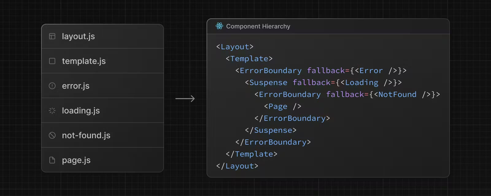
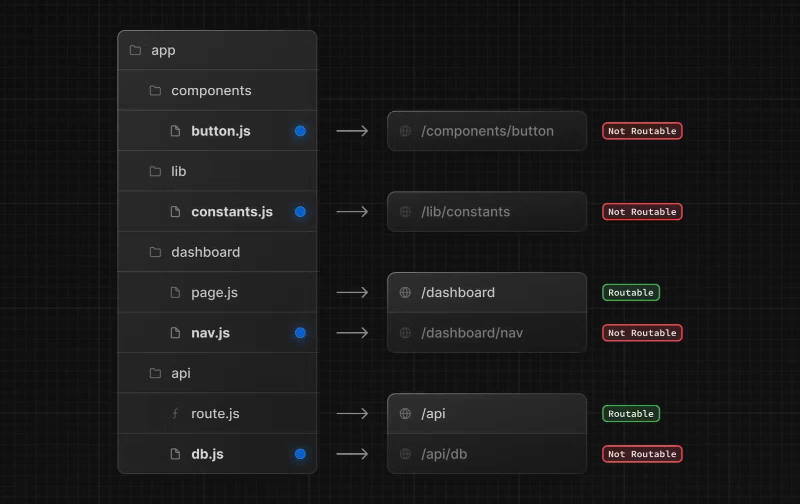
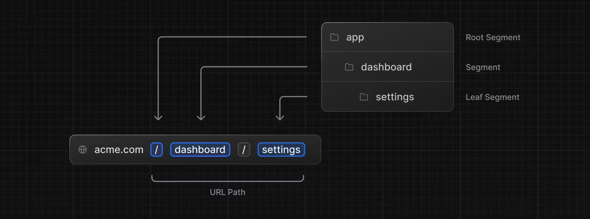

<!-- Next.js v16 기준으로 작성되었습니다. -->

# Next.js?

- Vercel에서 개발한 React 프레임워크
- 서버 사이드 렌더링(SSR), 클라이언트 사이드 렌더링(CSR), API 라우팅 등의 다양한 최적화 기능 제공
- React의 기본 기능을 확장해, 보다 빠르고 안정적으로 웹 애플리케이션 개발 가능

## Installation and configuration

```bash
npx create-next-app@latest 프로젝트이름
  ✔ Would you like to use the recommended Next.js defaults? › No, customize settings
  ✔ Would you like to use TypeScript? … No / Yes  # 타입스크립트 사용 여부
  ✔ Which linter would you like to use? › ESLint  # ESLint 사용 여부
  ✔ Would you like to use React Compiler? … No / Yes  # React Compiler 사용 여부
  ✔ Would you like to use Tailwind CSS? … No / Yes  # Tailwind CSS 사용 여부
  ✔ Would you like your code inside a `src/` directory? … No / Yes  # src/ 디렉토리 사용 여부
  ✔ Would you like to use App Router? (recommended) … No / Yes  # App Router 사용 여부
  ✔ Would you like to customize the import alias (`@/*` by default)? … No / Yes  # `@/*` 외 경로 별칭 사용 여부
```

---

## 기본 구성 요소(Component & Function)

**Default**

- `tsx` Server Component
- `ts` Shared Function

### 1. Server Component

`Server Function` 과 같은 환경이기에 동일한 특징을 갖고있습니다. (자세한 내용은 참조)

**특징**

- `async/await Component` 서버에서 생성/전달하기에 컴포넌트 자체도 async/await 가능
- **Chapter**
  - `Client Component` ✅ 사용 가능
  - `Server/Shared Function` ✅ 사용 가능
  - `Server Actions` ⚠️ 사용 가능하지만 사용 지양
  - `Client Function` ❌ 사용 불가
- `env` ✅ DB/private 를 포함한 모든 변수 사용 가능
- `SSR` SEO 유리 / 초기 렌더링 / 데이터 prefetch 에 유리
- `RSC` 작업이 서버에서만 진행되어 보안 강화
- `dynamic` 서버 컴포넌트를 CSR 처리 → 브라우저에서 렌더링  
  기본적으로 `ssr: true` 상태지만 `dynamic(ssr: false)` 로 진행 시  
  서버 렌더링에서 제외 → HTML 에서도 안보임

### 2. Client Component

`Client Function` 과 같은 환경이기에 동일한 특징을 갖고있습니다. (자세한 내용은 참조)

**특징**

- `'use client'` 필수
- **Chapter**
  - `Server Component` ❌ 사용 불가
  - `Client/Shared Function` ✅ 사용 가능
  - `Server Actions` ✅ 사용 가능하지만 직접 접근은 지양
  - `Server Function` ⚠️ 사용 가능하지만 사용 지양
- `env` ⚠️ NEXT*PUBLIC*\* 만 사용 가능
- `CSR` 작업이 client 에서 진행되어 코드 노출 가능(보안 ❌)
- `SPA` SEO 불리, 번들(JS)에 포함되어 browser 로 전달

> ℹ️ 클라이언트 컴포넌트 또한 일부 정적 요소는 서버에서 렌더링합니다.
>
> > 따라서 클라이언트 컴포넌트는 '서버 + 클라이언트'의 하이브리드 컴포넌트로 이해해야 합니다!

### 3. Shared Function

**특징**

- `async/await` 가능(client/server 상관없음)
- `Client | Server Component` 실행 위치에 따라 결정
  - ex: `zod`
    - `schema 자체` 공용(shared)
    - `form validation` Client Function
    - `server validation` `prisma` `JPA Entity` Server Function
  - ex: `prefetch/queries`
    - `useQuery(queriesOption)` Client Function
    - `await queryClient.prefetchQuery(queriesOption)` Server Function
- `React/Next` 실행 위치에 따라 `Client | Server Function` 결정
  - `import from 'next/..'` ⚠️ 무조건 `Server Function` 아님(실행 위치로 결정)  
    next 제공이지만 서버/클라이언트 기능을 모두 포함한 것을 인지  
    util 처럼 편의성 제공 라이브러리 정도로 생각
  - `hooks` ✅ hooks 는 무조건 `Client Function` 확정
- 공용 함수로 유지하려면 `Client | Server 전용 요소/API` 가 없어야 안전
- `import from 'next/..'` next 제공 라이브러리여도 서버/클라이언트 기능을 모두 포함한 것을 인지  
  ⚠️ 무조건 서버 함수 아님(=util 처럼 편의성을 제공해주는 라이브러리 정도로 생각)

### 4. Server Function

다음의 경우에 해당하면 서버 함수로 판단합니다.

1. `Shared Function` → `Server Component` 에서 실행
2. `서버 전용 요소 | API` 사용
3. `import 'server-only'` 사용
4. `use server` → ⚠️ 서버 함수가 아닌 서버 액션으로 판단(서버 액션 in 서버 함수)

**특징**

- Node.js 서버 환경에서 실행
- DB/API/private logic 처리
- **Chapter**
  - `Server/Shared Function` ✅ 사용 가능
  - `Server Actions` ⚠️ 사용 가능하지만 사용 지양
    - 사실상 서버로 통하는 통로 역할이라 굳이 복잡성 증가 필요없음
  - `Client Function` ❌ 사용 불가
    - ❌ browser API(windows/document/localStorage) 역시 사용 불가
- `env` ✅ DB/private 를 포함한 모든 변수 사용 가능
- `SSR` SEO 유리 / 초기 렌더링 / 데이터 prefetch 에 유리
- `RSC` 작업이 서버에서만 진행되어 보안 강화
- `import 'server-only'` 사용 시 강제로 확정 → ❌ Client 에서 사용 불가

#### Server-only elements

```
DB
Prisma
private env
fs
backend SDK
...
```

#### Server-only API

```
cookies
headers
redirect, notFound
generateMetadata
revalidatePath
...
```

### 5. Client Function

다음의 경우에 해당하면 클라이언트 함수로 판단합니다.

1. `Shared Function` → `Client Component` 에서 실행
2. `React` hooks 사용
3. `클라이언트 요소 | API` 사용 → 사용을 위해 `'use client'` 필수
4. 사실상 `'use client'` 사용

**특징**

- 브라우저 환경에서 실행
- `'use client'` 사용
  - 선언된 파일 내부의 코드가 Client 환경으로 처리
  - 필수는 아니지만 hooks 사용을 위해 사실상 필수
- `hooks` ✅ 사용 가능
  - `React` use 접두사로 시작하는 함수
  - 'use client' 내에서만 사용 가능
- `browser API(windows/document/localStorage)` ⚠️ 접근 가능
  - 사용 가능하지만 prerender 로 인해 useEffect 안에서 사용해야함
- **Chapter**
  - `Client/Shared Function` ✅ 사용 가능
  - `Server Actions` ✅ 사용 가능하지만 직접 접근은 지양
  - `Server Function` ⚠️ 사용 가능하지만 사용 지양
    - prerender/hydration 과정으로 인해 2번 실행 위험(`server` prerender, `client` hydration)
    - 서버 코드 노출 가능(보안 ❌)
    - prisma, cookies, private env 등 서버 전용 API 가 포함되면 ❌ 빌드 에러 발생 → ❌ 사용 불가
    - ✅ Route Handler/Server Actions 을 통한 접근 지향
- `env` ⚠️ NEXT*PUBLIC*\* 만 사용 가능
- `CSR` 작업이 client 에서 진행되어 코드 노출 가능(보안 ❌)
- `SPA` SEO 불리, 번들(JS)에 포함되어 browser 로 전달

#### Client-only elements

```
'use client'
hooks
document
event handler

useEffect({
  windows
  localStorage
})
...
```

#### Client-only API

```
useState, useEffect
onClick, onChange
useRouter
useParams, useSearchParams
useFormState
useOptimistic
...
```

---

## Remote Procedure Call

> **`RPC`** Remote Procedure Call

"원격에 있는 함수를 마치 내 코드의 함수처럼 호출하는 방식" 입니다.  
`Client` 와 `Server` 는 서로 다른 실행 환경이기에 서로 직접 호출 시 → ❌ 빌드 에러 발생

> `Client` → `서버 진입점(entrypoint)` → `Server`

그래서 반드시 해당 과정을 거쳐야하는데, 이 때 사용되는 개념이 `RPC` 입니다.

**특징**

- 브라우저가 서버에게 함수 실행을 요청하고 결과를 돌려받는 구조
- 코드 상으로는 함수 호출이지만 실제로는 네트워크 요청 발생
- 연결 통로 역할만을 수행해야함 → ❌ 비즈니스 로직
- `Next.js` RPC
  - `Server Actions` 자동
  - `Route Handler` 수동

### RPC Function Simple

#### 1. Public API

`Server 전용 요소/API` 가 없고, public env 만 사용한 API

**특징**
서버 진입점(Server Actions/Route Handler) 을 거치지 않고, 바로 `fetch` 로 연결

```tsx
export async function publicApi() {
  await fetch(`${process.env.NEXT_PUBLIC_URL}`, {
    method: 'POST',
    headers: { Authorization: `${process.env.API_KEY}` },
    body: JSON.stringify({ input: 'params' })
  })
}
```

> 함수의 모든 내용과 URL/Header/Payload/Response 까지 모두 노출

#### 2. Server Actions

Client 에서도 호출 가능한 서버 함수

**특징**

- `'use server'` 필수
- 직접 접근 ❌
  - 서버 함수와 동일하게 prerender 로 인해 반복 위험
- 간접 접근 ✅
  - `form action` FormData 자동 전달
  - `form submit | event handler` 인자 자유(type 설정)
  - `button formAction` form action 과 동일
- `자동 RPC`
  - 명시적 URL endpoint 작성 불필요
  - Client 에서 호출해도, 작업은 Server 내부에서만 진행 후 전달되어 보안 상 안전
- `변경` mutation 기반(POST) 최적화 → 생성/수정/삭제
- `env` ✅ DB/private 를 포함한 모든 변수 사용 가능

**진행**

```
개발자는 함수만 연결하면 되고

- serialization
- HTTP 요청
- action endpoint 생성 및 action id 매핑
- form 처리
- revalidatePath/redirect 연동

등을 Next.js 가 자동 처리합니다.
```

**흐름**

```txt
Browser
  ↓ form submit/event handler
Client
  ↓ `자동 RPC` Next/React
Server Action
  ↓ service
Server Function
  ↓ repository
DB
```

**사용 방식**

```ts
/* Server Action */
'use server'
export async function action() { ... }
```

```ts
/* Inline Server Action  */
export default function ServerComponent() {
  async function action() {
    'use server'
    ...
  }
  return <form action={action}></form>
}
```

```tsx
'use client'
export default function ClientComponent() {
  action() // ❌ `직접` 렌더링 중 서버 작업 호출
  return (
    <div>
      <button onClick={() => action()}>호출</button> // ✅ `간접` 호출
    </div>
  )
}
```

```tsx
<form>
  <button formAction={saveDraft}>임시저장</button>
  <button formAction={publishPost}>발행</button>
</form>
```

#### 3. Route Handler

HTTP endpoint 역할을 하는 서버 진입점

**특징**

- 명시적 HTTP API 호출 방식
- 개발자가 직접 API endpoint 를 만들고, 직접 HTTP 요청을 보내는 구조
- FE/BE API 분리 쉬움
- 세밀한 제어 가능
- `수동 RPC`
  - 직접 URL endpoint 작성
  - Client 에서 호출해도, 작업은 Server 내부에서만 진행 후 전달되어 보안 상 안전
- `조회` URL 기반(GET) 최적화 → 검색/필터/페이징
- `env` ✅ DB/private 를 포함한 모든 변수 사용 가능

**진행**

```
개발자가 직접

1. `app/**/route.ts` URL endpoint 생성
2. `HTTP method` 함수 작성 → `GET/POST/PUT/PATCH/DELETE`
3. `request parsing`
  - params, searchParams
  - request.json(), request.formData()
  - headers, cookies
4. `validation`
5. `revalidate/cache`
6. `response`
7. `error`
  - try/catch
  - validation error
  - server error

을 작성합니다.
```

**흐름**

```txt
Browser
  ↓ form submit/event handler
Client
  ↓ `수동 RPC` fetch
Route Handler
  ↓ service
Server Function
  ↓ repository
DB
```

**사용 방식**

```
├─app
│ ├─users/
│ │ └─page.tsx
│ ├─api
│ │ └─users/
│ │   └─route.ts
```

```typescript
/* app/api/users/route.ts */
import { NextRequest, NextResponse } from 'next/server'
import { createUser } from '@/server/user.service'

export async function GET(req: Request, params: Promise<{ userId: string }>) {
  const { userId } = await params // 동적 경로
  const res = await fetch(`/url?userId=${userId}`)
  const data = await res.json()
  return Response.json(data)
}

export async function POST(req: NextRequest) {
  // const body = await req.json() // 요청 바디
  const searchParams = req.nextUrl.searchParams // 쿼리스트링
  const sort = (searchParams.get('sort') || 'name') as keyof User

  /* const res = await fetch('/url')
  const { data } = (await res.json()) as ResponseUser */
  const user = await createUser(body)
  return NextResponse.json(user, { status: 201 })
}
```

```typescript
import { NextRequest, NextResponse } from 'next/server'
import axios from 'axios'
import { z } from 'zod'
import { revalidatePath } from 'next/cache'
import { createUser } from '@/server/user.service'

export async function GET(req: NextRequest) {
  return axios
    .get<ResponseUser[]>(`${process.env.PRIVATE_URL}`)
    .then(res => NextResponse.json(res.data))
}

export async function POST(req: NextRequest) {
  try {
    const body = await req.json()
    const payload = z.req.schema.parse(body)
    /* const data = await axios
      .post(`${process.env.PRIVATE_URL}`, body)
      .then(res => NextResponse.json(res.data))
    revalidatePath('/url')
    const result = z.res.array.schema.safeParse(data) */
    const result = await createUser(body)
    return NextResponse.json(result, { status: 201 })
  } catch (err) {
    if (error instanceof z.ZodError) {
      return NextResponse.json(
        { message: 'Invalid request', errors: z.treeifyError(error) },
        { status: 400 }
      )
    }
    return NextResponse.json(
      { message: 'Internal server error' },
      { status: 500 }
    )
  }
}
```

### RPC Function Detail

조회는 `Route Handler`, 변경은 `Server Action` 사용이 최적화

- `조회` URL 기반(GET) 선호
- `변경` mutation 기반(POST) 선호

```txt
조회는 대부분

- 새로고침 유지
- 공유/북마크 가능
- 뒤로가기 지원
- SEO 가능
- 서버 prerender 가능

이 필요하다.
```

> Next.js App Router 는 searchParams(queryString) 중심으로 설계되어 URL 기반(GET) 최적화가 가능하다.

**Server Action**

```txt
Server Action 은 `현재 화면에서 서버 작업 수행` 이다.

- Next/React 에서 자동 POST 요청
- URL 기반이 아닌 함수 기반
- 검색 조건이 URL에 안남음(action 내부 상태 호출)
- 공유/복원 어려움

따라서 조회와는 거리가 멀다.
```

**Route Handler**

```txt
Route Handler 는 사실상 `상태 변경 → 새로운 화면` 이다.

1. URL 변경
2. 서버 page.tsx 재실행
3. prefetch/query 재실행
4. SSR/RSC 재생성

이 자동 연결된다.
```

> `검색/필터/정렬/페이징` 은 대부분 `현재 페이지 상태 변경` 이다. (GET 궁합)

#### 1. useFormStatus

**특징**

- 현재 form submit 상태
- props drilling 없음
- 복잡한 form 내부의 깊은 컴포넌트에서 현재 form 의 submit 상태 확인 가능
- `주 사용처` 버튼 disable/loading

**사용 방식**

```tsx
export default function Page() {
  return (
    <form action={createAction}>
      <FormFields />
      <SubmitButton />
    </form>
  )
}

;('use client')
import { useFormStatus } from 'react-dom'
export function SubmitButton() {
  const { pending } = useFormStatus()
  return <Button disabled={pending}>{pending ? '저장 중...' : '저장'}</Button>
}
```

#### 2. useActionState

**특징**

- 해당 action state transition 상태
- `주 사용처` form validation / action 연결

**사용 방식**

```tsx
'use client'
import { useActionState } from 'react'

type State = {
  message?: string
  error?: string
}

const initialState: State = {
  message: '',
  error: ''
}

export default function Page() {
  const [state, formAction, isPending] = useActionState(
    createAction,
    initialState
  )

  async function formAction(
    prevState: State,
    formData: FormData
  ): Promise<State> {
    'use server'
    const name = String(formData.get('name') ?? '')
    if (!name) return { error: 'Invalid request' }
    await service.create({ name })
    return { message: 'success' }
  }

  return (
    <form action={formAction}>
      <FormFields />
      <SubmitButton />

      {isPending && <p>처리 중...</p>}
      {state.error && <p>{state.error}</p>}
      {state.message && <p>{state.message}</p>}
    </form>
  )
}
```

```tsx
'use client'
import { useActionState } from 'react'

export default function Page() {
  const [createState, createFormAction, createPending] = useActionState(
    createAction,
    initialState
  )

  const [deleteState, deleteFormAction, deletePending] = useActionState(
    deleteAction,
    initialState
  )

  return (
    <form>
      <button formAction={createAction}>저장</button>
      <button formAction={deleteAction}>삭제</button>
    </form>
  )
}
```

> 하나의 Server Action 만 사용하는 단순한 form 구조의 얕은 컴포넌트라면  
> `useFormStatus` `useActionState` 모두 Server Action 완료 상태만 확인

#### 3. useTransition

비동기 작업 실행 시, 작업은 백그라운드에서 실행하고 화면 UI 는 유지하여 UX 향상

**특징**

- UI blocking 완화(버튼 클릭해도 UI 유지)
- 낮은 우선순위 업데이트 처리
- 사용자 입력 반응성 유지(입력 끊김 감소)
- Server Action 실행 중 로딩 상태 표현(pending)
- 필요 시 낙관적 업데이트(useOptimistic) 와 함께 사용
- 중복 클릭 방지 로직이 필요하다. (ex: disable)

**사용 방식**

```tsx
'use client'
import { useTransition } from 'react'
export function DeleteButton({ id }: { id: string }) {
  const [isPending, startTransition] = useTransition()
  const handleClick = () => {
    startTransition(async () => {
      await deleteAction(id)
    })
  }
  return (
    <button
      disabled={isPending}
      onClick={handleClick}>
      {isPending ? '삭제 중...' : '삭제'}
    </button>
  )
}
```

#### 4. useOptimistic

낙관적 업데이트 기능 제공

**Route Handler**

```tsx
'use client'
import { useTransition, useOptimistic } from 'react'
export default function LikeButton({ initialLikes }: { initialLikes: number }) {
  const [isPending, startTransition] = useTransition()
  /* const [optimisticState, addOptimistic] = useOptimistic(
    state,
    (currentState, optimisticValue) => { ... }
  ) */
  const [optimisticLikes, addOptimisticLike] = useOptimistic(
    initialLikes,
    (state, amount: number) => state + amount
  )

  async function increaseLike() {
    startTransition(async () => {
      addOptimisticLike(1) // 1. UI 먼저 증가
      await axios.post('/api/like') // 2. 서버 요청(백그라운드)
    })
  }

  return (
    <button
      onClick={increaseLike}
      disabled={isPending}>
      👍 {optimisticLikes}
      {isPending && ' ...'}
    </button>
  )
}
```

**Server Action**

```tsx
'use client'
export default function LikeButton({ initialLikes }: { initialLikes: number }) {
  ...
  async function increaseLike() {
    startTransition(async () => {
      addOptimisticLike(1) // 1. UI 먼저 증가
      await increaseLikeAction() // 2. 서버 요청(백그라운드)
    })
  }
  ...
}
```

```tsx
'use server'
export async function increaseLikeAction() {
  // await axios.post(${process.env.PRIVATE_URL})
  await axios.post(process.env.PRIVATE_URL!) // Non-null assertion operator
}
```

### React Query

`isPending` 서버 진입점(RPC) → Server Action/Route Handler 를 호출 중인 상태

> `useFormStatus` `useActionState` isPending  
> `react-query` isLoading(isFetching && isPending)  
> 둘은 동일한 대상의 상태 확인으로 사실상 같은 역할이라 대체 가능
>
> > `react-query` pending/RPC 연결(queryFn)/캐싱 등 다양한 기능을 제공  
> > 단순 form action 이 아닌 이상, 일반적으론 react-query 만 사용

#### 1. prefetchQuery

HTML 전달 이전 Server 에서 초기 데이터 셋팅

- `SSR` SEO 유리 / 초기 렌더링

**사용 방식**

```tsx
import {
  QueryClient,
  HydrationBoundary,
  dehydrate
} from '@tanstack/react-query'
export default async function Page() {
  const queryClient = new QueryClient()
  await queryClient.prefetchQuery({
    queryKey: ['key'],
    queryFn: () => service() // Server Component 기에 RPC 거치지않고 바로 호출
  })

  return (
    <HydrationBoundary state={dehydrate(queryClient)}>
      <SnackList />
    </HydrationBoundary>
  )
}
```

```tsx
export default async function Snack({
  searchParams
}: {
  searchParams: Promise<Record<string, string | undefined>>
}) {
  const queryClient = new QueryClient()
  await prefetchPage(queryClient, searchParams)

  return (
    <HydrationBoundary state={dehydrate(queryClient)}>
      <SnackList />
    </HydrationBoundary>
  )
}

export async function prefetchPage(
  queryClient: QueryClient,
  params: SearchParams
) {
  await Promise.all([
    queryClient.prefetchQuery(queryOptions1()),
    queryClient.prefetchQuery(queryOptions2()),
    queryClient.prefetchQuery(listQueryOptions(params))
  ])
}
```

#### 2. useQuery

~~예제는 `직접` 사용이지만, 실무에선 지양~~  
hook 에서 사용했기 때문에 Client 에서 렌더링되어 prerender 영향 없음

> form action/event handler → RPC(Route Handler) 사용
>
> > Route Handler → Client 에서 Server Function 호출은 원래 불가능  
> > 하지만 서버 진입점(RPC) 으로 인해 Public API(Shared Function) 호출과 동일하게 가능

**사용 방식**

```tsx
'use client'
import { useQuery } from '@tanstack/react-query'
export default function Page() {
  const { data, refetch, isLoading, isFetching } = useQuery({
    queryKey: ['key', searchParams],
    queryFn: () => axios.get('/api/route')
  })

  if (isLoading) return <div>조회 중...</div>

  return (
    <>
      {isFetching && <SmallSpinner />}
      <List data={data ?? []} />
      <button onClick={() => refetch()}>검색</button>
    </>
  )
}
```

#### 3. useSuspenseQuery

~~예제는 `직접` 사용이지만, 실무에선 지양~~  
hook 에서 사용했기 때문에 Client 에서 렌더링되어 prerender 영향 없음

> form action/event handler → RPC(Route Handler) 사용
>
> > Route Handler → Client 에서 Server Function 호출은 원래 불가능  
> > 하지만 서버 진입점(RPC) 으로 인해 Public API(Shared Function) 호출과 동일하게 가능

**사용 방식**

```tsx
'use client'
import { useSuspenseQuery } from '@tanstack/react-query'
import { Suspense } from 'react'
export default function Page() {
  const { data, isFetching } = useSuspenseQuery({
    queryKey: ['key', searchParams],
    queryFn: () => axios.get('/api/route')
  })

  return (
    <>
      <Suspense fallback={<div>조회 중...</div>}>
        {isFetching && <SmallSpinner />}
        <List data={data} />
        <button onClick={() => refetch()}>검색</button>
      </Suspense>
    </>
  )
}
```

**ReactQueryStreamedHydration**

- streaming hydration 을 전역으로 활성화
- cache 를 streaming 으로 더 빠르게 전달(최적화)
- useSuspenseQuery 의 "Suspense 발생 빈도/시간" 을 줄여주는 역할

#### 4. useMutation

필요 시 낙관적 업데이트(onMutate) 와 함께 사용

**사용 방식**

**`form action`**  
단순 form action

```tsx
'use client'
import { revalidatePath } from 'next/cache'
import { useFormStatus } from 'react-dom'
export default function Page() {
  async function createAction(formData: FormData) {
    'use server'
    const data = {
      param1: String(formData.get('param1') ?? ''),
      param2: String(formData.get('param2') ?? '')
    }
    await createService(data)
    revalidatePath('/url') // 수동 refetch
  }

  function SubmitButton() {
    'use client'
    const { pending } = useFormStatus()
    return (
      <button
        type="submit"
        disabled={pending}>
        {pending ? '변경 중...' : '변경'}
      </button>
    )
  }

  return (
    <>
      <form action={createAction}>
        <FormFields />
        <SubmitButton />
      </form>
    </>
  )
}
```

> `useActionState` 을 통해 조금 더 다양한 기능/편의성을 제공할 수 있기는 함

**`useMutation`**

```tsx
'use client'
import { useQueryClient, useMutation } from '@tanstack/react-query'
export default function Page() {
  const queryClient = useQueryClient()
  const { mutate, mutateAsync, error, isPending, isError } = useMutation({
    mutationFn: createAction, // Server Action
    // 낙관적 업데이트(onMutate & onError)
    onMutate: async newUser => {
      await queryClient.cancelQueries(queryOptions)
      const preUsers = queryClient.getQueryData<Users>(queryOptions.queryKey)
      if (preUsers) {
        queryClient.setQueryData<Users>(queryOptions.queryKey, [
          ...preUsers,
          newUser
        ])
      }
      return { preUsers }
    },
    onError: (_error, _newUser, context) => {
      if (context?.preUsers) {
        queryClient.setQueryData(queryOptions.queryKey, context.preUsers)
      }
    },
    onSuccess: () => {
      // queryClient.refetchQueries  // 강제 refetch
      queryClient.invalidateQueries(queryOptions) // 자동 refetch
    }
  })

  // ❌ 불가능
  async function createAction(formData: FormData) {
    'use server'
    ...
    mutate(formData)
  }

  // 복잡한 작업에는 async/await mutateAsync 사용 → 세밀한 제어 가능
  async function handleSubmit(e: React.FormEvent) {
    e.preventDefault()
    const formData = new FormData(e.currentTarget)
    const data = {
      param1: String(formData.get('param1') ?? ''),
      param2: String(formData.get('param2') ?? '')
    }
    await mutateAsync(data)
    e.currentTarget.reset()
  }

  return (
    <>
      <form onSubmit={handleSubmit}>
        <FormFields />
        <button
          type="submit"
          disabled={isPending}>
          {isPending ? '변경 중..' : '변경'}
        </button>
        {isError && <p>{error.message}</p>}
      </form>
    </>
  )
}
```

> Server Action 안에서 Client Hook 결과물인 mutate 호출 불가

### Overview

**서버 진입점(RPC)**

| 항목                    | Server Actions                                 | Route Handler                                    |
| ----------------------- | ---------------------------------------------- | ------------------------------------------------ |
| 성격                    | 서버 함수 원격 호출                            | HTTP API endpoint                                |
| HTTP Method             | `POST` 고정(`POST /__next_action`)             | `GET/POST/PUT/PATCH/DELETE`                      |
| 필수(required)          | `'use server'` 선언 필수                       | `/app/api/**` 경로 위치                          |
| 주 용도                 | `변경` 생성/수정/삭제                          | `조회` 검색/필터/페이징                          |
| RPC                     | `자동` Next/React 가 자동으로 요청/연결        | `수동` 직접 endpoint 작성 → 직접 호출            |
| 호출 방식               | `form action` `event handler`                  | `fetch` `axios`                                  |
| private/DB env          | ✅ 가능                                        | ✅ 가능                                          |
| 주 사용처               | 내부 화면 전용                                 | 내부/외부/모바일/서드파티 연동 가능              |
| API 재사용              | ⚠️ 어려움                                      | ✅ 쉬움                                          |
| pending                 | `useFormStatus` `useActionState` `useMutation` | `useQuery` `useSuspenseQuery`                    |
| 입력                    | `FormData` 또는 serializable argument          | Request body/query/path/header                   |
| 출력                    | serializable return, redirect, revalidate      | JSON, Response, status, header                   |
| revalidatePath/redirect | 자동                                           | 수동                                             |
| 인증/보안               | server actions 함수 내부에서 auth 검증 필수    | route 내부/middleware(proxy) 에서 auth 검증 필수 |

**기술 스택**

| 항목             | useFormStatus          | useActionState                   | prefetchQuery             | useQuery               | useSuspenseQuery       | useMutation            | useTransition              |
| ---------------- | ---------------------- | -------------------------------- | ------------------------- | ---------------------- | ---------------------- | ---------------------- | -------------------------- |
| 실행 환경        | Client                 | Client                           | Server \| Client          | Client                 | Client                 | Client                 | Client                     |
| 메인             | form                   | Server Actions                   | Server \| Client Function | Client Function        | Client Function        | Client Function        | Client Function            |
| 실행 트리거      | form submit            | Server Action                    | queryFn                   | queryFn                | queryFn                | mutationFn             | startTransition            |
| 필수             | 상위 form              | Server Actions                   | queryKey                  | queryKey               | queryKey               | queryKey               | async/await                |
| import           | react-dom              | react                            | react-query               | react-query            | react-query            | react-query            | react                      |
| 입력             | 실행 컴포넌트 위치     | reducerAction, initialState      | queryOptions              | queryOptions           | queryOptions           | mutationOptions        | callback                   |
| 출력             | pending, data          | state, dispatchAction, isPending | Promise                   | data, isLoading, error | data                   | mutate                 | isPending, startTransition |
| 용도             | 변경                   | 변경                             | 조회                      | 조회                   | 조회                   | 변경                   | 조회/변경                  |
| 주 사용처        | 버튼 disable / loading | form validation / action 연결    | 초기 데이터               | 일반 조회              | 초기 렌더링 + Suspense | 변경                   | 좋아요/토글/버튼 disable   |
| pending 범위     | Server Action 완료     | Server Action 완료 + state 반영  | prefetch 완료             | fetch 완료             | suspense resolve       | mutation 완료          | callback 완료              |
| HTML 기본 동작   | ✅ browser form 동작   | ✅ browser form 동작             | ❌ 미사용                 | ❌ 미사용              | ❌ 미사용              | ❌ 미사용              | ❌ 미사용                  |
| JS 비활성화 대응 | ✅ form submit 가능    | ✅ Server Action 가능            | ❌ 불가                   | ❌ 불가                | ❌ 불가                | ❌ 불가                | ❌ 불가                    |
| SEO              | ✅ SSR                 | ✅ SSR                           | ✅ SSR                    | ⚠️ CSR                 | ✅ SSR                 | ❌ 불가                | ❌ 불가                    |
| 캐싱             | ❌ 불가                | ❌ 불가                          | ✅ 가능                   | ✅ 가능                | ✅ 가능                | ⚠️ 부분적(무효화 필요) | ❌ 미사용                  |

mutate, mutateAsync, isPending, data, error

좋아요/북마크/토글/버튼 disable

---

## Server vs Client

- `Server` Node.js / Edge runtime 환경에서 완료
- `Client` Browser 와 거의 동일한 의미  
  다만, 굳이 따지면 "hydration 이전" 을 의미  
  서버에서 미리 실행하여 확인 후, Browser 환경에서 최종 완료
- `Browser` hydration 이후(=완료)

### Step-by-step Simple

#### 1. `Server` prerender

- `Server Component/Function` 완료 / HTML 반영
- `Client Component` 완료 / HTML 반영
- `Client Function` 미리 실행하여 확인 / HTML 미반영

#### 2. `Server` ssr

- SSR 적용(SEO 가능)

#### 3. `Browser` html

- 화면으로 조회 가능

#### 4. `Browser` hydration start

- `Client Function` useEffect 를 제외한 나머지 모두 완료(window/document 포함) / HTML 반영

#### 5. `Browser` hydration end

- `Client Function` useEffect 완료 / HTML 반영

### Step-by-step Detail

```
0. `Server` 컴파일/번들 준비
모두 통과 시, 서버 실행(npm run)
- 번들(bundle) 생성
- Server/Client graph 분석
- RSC 규칙 검사

1. `Browser` 웹 요청
GET /

2. `Server` Next 서버가 React 렌더링
서버에서 해당 페이지의 컴포넌트/함수를 실행하여 확인(+데이터도 확보)
`Server` 컴포넌트/함수 모두 완료
`Client` 컴포넌트/함수 모두 완료

※ 서버 터미널 출력
console.log('Server Component')
console.log('Client Component')
console.log('render')

3. `Server` HTML 생성
SSR / prerender

4. `Server` HTML 전달

5. `Browser` 브라우저가 HTML 즉시 표시
사용자(고객) 이 화면 조회 가능

⚠️ 화면은 보이지만 interactive 아님
`Server` 컴포넌트/함수 모두 완료 → 데이터 존재(HTML 에 반영됨)
`Client` 컴포넌트만 완료 → 함수 미실행 단계(HTML 에 반영되지 않음)

6. `Browser` JS 다운로드
- Client Component bundle(JS)
- React runtime
- Next runtime

7. `Browser` hydration 시작
React가 서버에서 받은 HTML과 브라우저의 Client Component를 연결

※ 브라우저 콘솔 출력
console.log('Client Component')
console.log('render')

8. `Browser` interactive 상태 활성화
hydration 완료
`Client` 함수 실행 및 완료

※ 브라우저 콘솔 출력
console.log('effect')  // useEffect 내부 console.log 실행
```

```typescript
'use client'

console.log('Client Component')

export default function Page() {
  console.log('render')

  useEffect(() => {
    console.log('effect')
  }, [])

  return <div>Hello</div>
}
```

#### Dictionary

- `Suspense` 비동기 데이터 대기
- `hydration` React 가 "이 HTML은 내가 만든 거구나" 라고 연결(binding)하는 과정  
  Client Function 에서 가능한 기능들(React, window, 이벤트 등) 아직 연결 안됨
- `dynamic` 기본적으로 ssr: true 상태지만 dynamic(ssr: false) 로 진행 시  
  서버 렌더링에서 제외(HTML 에서도 안보임) -> 브라우저에서 렌더링
- `Radix/shadcn Select` select options 을 갖고있는 것이 아니라  
  hydration 이후 Radix가 `portal 생성 -> option 생성 -> 이벤트 연결` 과정을 거쳐야 options 가 생성됨

```
`hydration 이전` placeholder만 보임, option 없음
`hydration 완료` options 생성
```

- `import from 'next/..'` ⚠️ 무조건 `Server Function` 아님(실행 위치로 결정)  
   next 제공이지만 서버/클라이언트 기능을 모두 포함한 것을 인지  
   util 처럼 편의성 제공 라이브러리 정도로 생각

---

## React vs Next.js

### 1. React

CRA, Vite

- `CSR(Client Side Rendering)` Server 에서 빈 HTML 을 보내고, Client 에서 완성
- `SPA(Single Page Application)` 하나의 페이지로 HTML 재요청(=페이지 새로고침) 없이 화면이 전환되어 UX 향상

**`장점`**

- 서버 부하 감소(초기 JS 만 전달하면 이후 렌더링은 브라우저에서 수행)
- 페이지 전환 부드러움(UX 향상)

**`단점`**

- SEO 불리
- 초기 로딩 느림
- 네트워크가 느리면 흰 화면만 보여 UX 저하

```
빈 HTML
→ JS 실행
→ React 렌더링
→ 화면 생성
```

> 즉, 브라우저가 React 렌더링을 전부 수행

```
1. Browser
 └─ GET /

2. Server
 └─ <div id="root"></div>

3. Browser
 └─ 빈 HTML 표시
 └─ JS 다운로드
 └─ React 실행
 └─ 화면 생성
```

### 2. Next.js

최초 데이터는 SSR(prefetch)  
이후 상호작용은 CSR

`SSR` Server 에서 HTML 을 완성해서 Client 에 내려주는 방식
`RSC` App Router 방식 / 서버에서 실행되는 React 컴포넌트

**`장점`**

- SEO 유리
- 초기 화면이 빠름(네트워크가 느려도 UX 향상)
- 보안성(서버 로직 노출 없음)

**`단점`**

- 서버 부하 증가(매 요청마다 서버 렌더링 수행)
- hydration 비용 존재

```
서버가 HTML 생성
→ 브라우저 표시
→ hydration
→ interactive 활성화
```

> 즉, 브라우저는 JS 실행 전에도 이미 화면이 있음

```
1. Browser
 └─ GET /

2. Next Server
 └─ React 렌더링
 └─ HTML 생성

3. Browser
 └─ HTML 즉시 표시
 └─ JS 다운로드
 └─ hydration
 └─ interactive 활성화
```

---

## Routing

### 1. Pages Router

Next.js 13 이전의 getServerSideProps 를 이용한 React 기반 예전 방식  
`app/` 이 아닌 `pages/` `index.tsx` 를 비롯한 페이지 중심

| 항목                   | Pages Router       | App Router         |
| ---------------------- | ------------------ | ------------------ |
| 폴더                   | `/pages`           | `/app`             |
| 기준                   | 페이지 중심        | 레이아웃/서버 중심 |
| 데이터 패칭            | getServerSideProps | async component    |
| React Server Component | ❌                 | ✅                 |
| layout                 | 제한적             | 강력               |
| loading.tsx            | ❌                 | ✅                 |
| streaming              | ❌                 | ✅                 |
| server actions         | ❌                 | ✅                 |

### 2. App Router

Next.js의 파일 규칙(File Conventions)  
명시적 컴포넌트 계층 구조(Component Hierarchy) 사용


| 기본 파일   | 확장자                | 설명                     |
| ----------- | --------------------- | ------------------------ |
| `page`      | `.js`, `.jsx`, `.tsx` | 기본 페이지              |
| `layout`    | `.js`, `.jsx`, `.tsx` | 고정 레이아웃            |
| `loading`   | `.js`, `.jsx`, `.tsx` | 로딩 페이지              |
| `error`     | `.js`, `.jsx`, `.tsx` | 에러 페이지              |
| `not-found` | `.js`, `.jsx`, `.tsx` | 찾을 수 없는 페이지(404) |
| `template`  | `.js`, `.jsx`, `.tsx` | 변화 레이아웃(탐색 시)   |

| 추가 파일      | 확장자                | 설명                                |
| -------------- | --------------------- | ----------------------------------- |
| `default`      | `.js`, `.jsx`, `.tsx` | 경로 병렬 기본 페이지               |
| `global-error` | `.js`, `.jsx`, `.tsx` | 전체 전역 에러 처리                 |
| `route`        | `.js`, `.ts`          | Route Handler 서버 진입점(endpoint) |

상단의 라우팅 파일 규칙에 해당하는 이름이 아닌 파일은  
경로로 정의되지 않기 때문에 자유롭게 사용 가능합니다.



#### Segment

Next.js 는 폴더를 사용해 경로를 정의하는 파일 시스템 기반 라우터 방식을 사용하기 때문에  
`📂app` 폴더 내에 생성하는 각 폴더는 기본적으로 URL 경로를 의미합니다.  
매핑되는 각 경로 구간을 세그먼트(Segment)라고 합니다.  


#### Segment Structure

- 동적 경로
  - `[폴더명]` 정확한 세그먼트(단일)
  - `[...폴더명]` 1개 이상의 하위 세그먼트(배열)
  - `[[...폴더명]]` 0개 이상의 하위 세그먼트(배열)
- `(폴더명)` 경로 무시
- `@폴더명` 경로 병렬 처리
- 경로 가로채기
  - `(.)폴더명` 동일 레벨 세그먼트
  - `(..)폴더명` 상위 레벨 세그먼트(1개)
  - `(..)(..)폴더명` 상위 레벨 세그먼트(2개)
  - `(...)폴더명` 루트 레벨 세그먼트

---

## Dynamic Route

미리 정의할 수 없는 동적인 경로는, 대괄호([])를 사용해 폴더 이름을 작성합니다.  
그러면 URL의 세그먼트 값이 params 로 전달되고, 대괄호 사이의 폴더명이 속성이 됩니다.  
만약 쿼리스트링(Query String)을 사용하는 경우, searchParams Prop으로 전달됩니다.

```typescript
/**
 * Server Component
 * @param params 동적 세그먼트
 * @param searchParams 쿼리스트링
 */
export default async function Page({
  params,
  searchParams
}: {
  params: Promise<{ movieId: string }>
  searchParams: Promise<{ plot?: 'short' | 'full' }>
}) {
  const { movieId } = await params
  const { plot } = await searchParams
  const res = await fetch(`/url?movieId=${movieId}&plot=${plot || 'short'}`)
  const movie: Movie = await res.json()
}
```

```typescript
/** Client Component */
'use client'
import { use, useState, useEffect } from 'react'
export default function Page({ ... }) {
  const { movieId } = use(params)
  const { plot } = use(searchParams)
  const [movie, setMovie] = useState<Movie | null>(null)

  useEffect(() => {
    const fetchMovie = async () => {
      const res = await fetch(`/url?movieId=${movieId}&plot=${plot || 'short'}`)
      const movie: Movie = await res.json()
      setMovie(movie)
    }
    fetchMovie()
  }, [movieId, plot])
}
```

※ param 이 없더라도 에러나지 않으며, hook 으로 유동적인 처리가 가능

```typescript
'use client'
import { useParams, useSearchParams } from 'next/navigation'
export default function Page() {
  const { movieId } = useParams()
  const plot = searchParams.get('plot')
}
```

#### Squence

```
├─📂app/
│ ├─📂movies/
│ │ ├─📂[movieId]/
│ │ │ └─page.tsx
│ ├─📂(group)/
│ │ ├─📂games/
│ │ │ ├─📂[gameId]/
│ │ │ │ ├─layout.tsx  # [gameId] 적용
│ │ │ │ └─page.tsx
│ │ │ ├─layout.tsx  # games 폴더 + [gameId] 적용
│ │ │ └─page.tsx
│ │ └─layout.tsx  # (group) 폴더 + games 폴더 + [gameId] 적용
│ └─layout.tsx  # 루트 전체 적용
```

> `app` → `(group)` → `games` → `[gameId]`
>
> > 순서가 늦게 적용될수록 덮어써짐

| 폴더 구조                             | URL                    | params                                |
| ------------------------------------- | ---------------------- | ------------------------------------- |
| `app/movies/[hello]/page.tsx`         | `/movies`              | ❌ 404 Error                          |
| `app/movies/[hello]/page.tsx`         | `/movies/apple`        | `{ hello: 'apple' }`                  |
| `app/movies/[hello]/page.tsx`         | `/movies/apple/banana` | ❌ 404 Error                          |
| `app/movies/[hello]/[world]/page.tsx` | `/movies/apple/banana` | `{ hello: 'apple', world: 'banana' }` |
| `app/movies/[...hello]/page.tsx`      | `/movies`              | ❌ 404 Error                          |
| `app/movies/[...hello]/page.tsx`      | `/movies/apple`        | `{ hello: ['apple'] }`                |
| `app/movies/[...hello]/page.tsx`      | `/movies/apple/banana` | `{ hello: ['apple', 'banana'] }`      |
| `app/movies/[[...hello]]/page.tsx`    | `/movies`              | `{}`                                  |
| `app/movies/[[...hello]]/page.tsx`    | `/movies/apple`        | `{ hello: ['apple'] }`                |
| `app/movies/[[...hello]]/page.tsx`    | `/movies/apple/banana` | `{ hello: ['apple', 'banana'] }`      |

---

## Async

다음 예제처럼 각각의 비동기 컴포넌트롤 동시에 호출하면 모두 완료되어야 화면이 출력됩니다.  
`Abc` 2초, `Xyz` 3초지만, 화면은 3초 후에 같이 출력됩니다.  
로딩되는 동안에는 `page.tsx` 와 같은 세그먼트의 `loading.tsx` 가 출력됩니다.

```typescript
export default async function Abc() {
  await wait(2000)
  return <></>
}

export default async function Xyz() {
  await wait(3000)
  return <></>
}

export default async function Page() {
  return (
    <>
      <Abc />
      <Xyz />
    </>
  )
}
```

각각의 페이지가 개별적으로 출력되기위해선 "비동기 컴포넌트 스트리밍" 기능이 필요합니다.  
이를 위해 `<Suspense>` 컴포넌트를 사용하면 비동기 컴포넌트가 스트리밍되고,  
`<Suspense>` fallback Prop 을 사용해 각 비동기 컴포넌트의 로딩 UI를 출력할 수 있습니다.

```typescript
import { Suspense } from 'react'
export default async function Page() {
  return (
    <>
      <Suspense fallback={<Loader color="red" />}>
        <Abc />
      </Suspense>
      <Suspense fallback={<Loader color="blue" />}>
        <Xyz />
      </Suspense>
    </>
  )
}
```

---

## Parallel Routes

Next.js v16부터 모든 병렬 경로 슬롯에 명시적인 default 컴포넌트가 필요하며, 없으면 빌드가 실패합니다.  
명시할 내용이 없다면, notFound() 호출이나 null을 반환하면 됩니다.  
`<Suspense>` 컴포넌트 활용 예제와 같은 로딩 애니메이션 및 페이지 결과가 출력됩니다.  
결과는 동일하지만, 이처럼 병렬 경로 처리 방식을 사용하면 각 페이지 컴포넌트가 독립적으로 로딩하고  
로딩/에러 상태를 각 컴포넌트별로 쉽게 분리할 수 있어 복잡한 컴포넌트의 분기 처리가 줄어들 수 있습니다.

```
├─app
│  ├─async
│  │  ├─@abc
│  │  │  ├─default.tsx
│  │  │  ├─loading.tsx
│  │  │  └─page.tsx
│  │  ├─@xyz
│  │  │  ├─default.tsx
│  │  │  ├─loading.tsx
│  │  │  └─page.tsx
│  │  ├─layout.tsx
│  │  └─page.tsx
```

```typescript
import { notFound } from 'next/navigation'
export default function Default() {
  notFound()
  // 혹은
  return null
}

export default function Layout({
  children,
  abc,
  xyz
}: {
  children: React.ReactNode
  abc: React.ReactNode
  xyz: React.ReactNode
}) {
  return (
    <>
      {children}
      {abc}
      {xyz}
    </>
  )
}
```

---

## Intercepting Routes

`app` 루트 이상으로는 가지 못하며, 레벨을 넘어서면 동일 선상의 URL 호출

| 접근 방식                                 | 화면                   |
| ----------------------------------------- | ---------------------- |
| `<Link href="/movies/hello">` 클릭        | **경로 가로채기 화면** |
| `router.push('/movies/hello')`            | **경로 가로채기 화면** |
| 브라우저 새로고침(F5)                     | **일반 화면**          |
| 주소창 직접 입력                          | **일반 화면**          |
| 새 탭 열기                                | **일반 화면**          |
| 외부 사이트에서 `/movies/hello` 링크 진입 | **일반 화면**          |
| `<a href="/movies/hello">`                | **일반 화면**          |
| 서버 컴포넌트 redirect('/movies/hello')   | **일반 화면**          |
| 초기 접속                                 | **일반 화면**          |
| `react` useState                          | **화면 이동 없음**     |
| `nuqs` setSearchParams(shallow: true)     | **화면 이동 없음**     |
| `nuqs` setSearchParams(shallow: false)    | **일반 화면**          |

- Client Navigation(Link/router.push) → 경로 가로채기(intercept)
- Direct Request(새로고침/주소창/새탭/SSR) → 일반 페이지 렌더링
- Client Function(React) → 클라이언트 컴포넌트의 상태만 변경

### Modal

경로 가로채기는 동작하는 구조/관리로 인해 @modal 슬롯과 함께 사용하는 것이 일반적입니다.

- 내부 이동 → 현재 화면 유지 + 모달만 open
- 새로고침 → 화면 페이지만
- 뒤로가기 → 모달만 close

> 게시글 Modal, 인스타그램, 쇼핑몰 상품 quick view, 댓글 상세, 로그인 Modal 등... 에 사용됩니다.

```
app/
├─ feed/
│  ├─ page.tsx
│  ├─ layout.tsx
│  └─ @modal/
│     ├─ default.tsx
│     └─ (..)photo/
│        └─ [id]/
│           └─ page.tsx
├─ photo/
│  └─ [id]/
│     └─ page.tsx
```

```typescript
/* /feed/page.tsx */
import Link from 'next/link'
export default function FeedPage() {
  return (
    <div>
      <h1>Feed</h1>
      <Link href="/photo/100">
        photo 100
      </Link>
    </div>
  )
}

/* /feed/layout.tsx */
export default function FeedLayout({
  children,
  modal
}: {
  children: React.ReactNode
  modal: React.ReactNode
}) {
  return (
    <>
      {children}
      {modal}
    </>
  )
}
```

```typescript
/* /feed/@modal/default.tsx */
export default function Default() {
  return null
}

/* /feed/@modal/(..)photo/[id]/page.tsx */
export default async function PhotoModal({
  params
}: {
  params: Promise<{ id: string }>
}) {
  const { id } = await params
  return <div className="modal">MODAL PHOTO: {id}</div>
}
```

```typescript
/* /photo/[id]/page.tsx */
export default async function PhotoPage({
  params
}: {
  params: Promise<{ id: string }>
}) {
  const { id } = await params
  return <div>FULL PAGE PHOTO: {id}</div>
}
```

| 폴더 구조                                       | 가로채는 URL          |
| ----------------------------------------------- | --------------------- |
| `app/movies/(.)hello/page.tsx`                  | `/movies/hello`       |
| `app/movies/(.)hello/world/page.tsx`            | `/movies/hello/world` |
| `app/movies/hello/(.)world/page.tsx`            | `/movies/hello/world` |
| `app/movies/(..)hello/page.tsx`                 | `/hello`              |
| `app/movies/(..)hello/world/page.tsx`           | `/hello/world`        |
| `app/movies/hello/(..)world/page.tsx`           | `/movies/world`       |
| `app/movies/(...)hello/page.tsx`                | `/hello`              |
| `app/movies/(...)hello/world/page.tsx`          | `/hello/world`        |
| `app/movies/hello/(...)world/page.tsx`          | `/world`              |
| `app/movies/hello/world/(...)guide/page.tsx`    | `/guide`              |
| `app/movies/(..)(..)hello/page.tsx`             | `/hello`              |
| `app/movies/(..)(..)hello/world/page.tsx`       | `/hello/world`        |
| `app/movies/hello/(..)(..)world/page.tsx`       | `/world`              |
| `app/movies/hello/world/(..)(..)guide/page.tsx` | `/movies/guide`       |

---

## Auth

[Auth.js(NextAuth.js) 핵심 정리](https://www.heropy.dev/p/MI1Khc)

---

## Cache

- `'use cache'` 필수

```typescript
/* next.config.ts */
const nextConfig: NextConfig = {
  // experimental: { ppr: true }  // v15 (Partial Prerendering)
  cacheComponents: true // v16
}
```

```typescript
'use cache' // 모듈 레벨
export default function Component() {
  'use cache' // 함수 레벨
}
```

- `cacheTag` 필요에 따라 태그 지정 가능  
  태그는 문자만 가능하며, 최대 256자 및 128개까지 지정
- `updateTag` 특정 태그를 포함하는 캐시를 만료하고, 캐시 컴포넌트나 함수를 다시 실행(RYW) 하고 결과를 캐싱  
  ℹ️ `RYW(Read-Your-Writes)`  
  클라이언트가 자신이 방금 기록한 데이터를 즉시 읽을 수 있도록 보장하는 일관성 모델  
  따라서 호출 후 화면에는 바로 최신 데이터가 표시되며, 변경사항을 즉시 표시해야 하는 경우에 유용  
  다중 태그 지정이 가능한 cacheTag 함수와 달리 updateTag 함수는 단일 태그만 가능하고, 서버 액션에서만 사용 가능
- `revalidateTag` 특정 태그를 포함하는 캐시를 만료할 수 있지만, 캐시 컴포넌트/함수는 추가 요청이 있을 때만 다시 실행  
  따라서 최신 데이터는 바로 표시되지 않으며, 게시물이나 기타 문서 업데이트 같이 지연 표시가 허용되는 상황에 유용  
  서버 액션뿐만 아니라 경로 핸들러(GET, POST 등의 API 함수)에서도 사용 가능  
  두 번째 인수로 캐시 프로필을 필수 지정해야 하며, 일반적으로는 'max'가 권장  
  ℹ️ `SWR(Stale-While-Revalidate)`  
  클라이언트가 캐시된 데이터를 사용하고, 서버가 백그라운드에서 데이터를 재생성하는 모델  
  지연 시간을 최소화해 성능과 사용자 경험을 최적화하는 캐싱 전략

### RYW

내가 방금 저장한 데이터가 즉시 조회되는 특성

```
게시글 작성
→ 바로 목록 조회
→ 내가 쓴 글 보임
```

### SWR

오래된 데이터를 먼저 보여주고, 백그라운드에서 최신 데이터 갱신

```
캐시 데이터 즉시 표시
→ 서버 재요청
→ 최신 데이터 교체
```

---

## Optimization

- `React Compiler` 자동으로 컴포넌트를 메모이제이션(memo/useCallback 자동화)
- `Image` 지연 로딩, 브라우저 캐싱, 크기 최적화 등의 기능을 아주 간단하게 사용할 수 있습니다.  
  src, alt, width, height 속성은 필수이며, 동일 소스 경로의 이미지는 자동으로 캐싱됩니다.  
  만약 원격의 이미지 경로를 사용한다면, 애플리케이션 보호를 위해 remotePatterns 옵션을 프로젝트 구성으로 추가해야 합니다.  
  포트 번호(port)나 구체적인 하위 경로(pathname)를 명시하는 것도 가능합니다.

```typescript
/* next.config.ts */
const nextConfig: NextConfig = {
  images: {
    remotePatterns: [
      {
        protocol: 'https',
        hostname: 'heropy.dev'
      },
      {
        protocol: 'https',
        hostname: '**.example.com',
        port: '80',
        pathname: '/account123/**'
      }
    ]
  }
}
```

- `Font` Next.js는 지원하는 모든 글꼴 파일에 대한 자체 호스팅(automatic self-hosting)이 내장되어 있습니다.  
  기본적으로 모든 Google Fonts를 자체 호스팅으로 지원하며, 구글 API로 별도 요청을 전송하지 않습니다.
- `Metadata` 검색 엔진 최적화(SEO) 에 적용될 데이터
  - `정적 데이터` 각 경로의 layout.tsx 혹은 page.tsx 파일에서 metadata 객체를 내보내면 됩니다.
  - `동적 데이터` generateMetadata 함수를 사용  
    다만, page 와 같은 API 요청을 사용하기 때문에 중복 요청 방지가 필요  
    fetch({ cache: 'force-cache' }) 옵션을 사용하거나, 'use cache' 를 사용하는 서버 액션을 사용하면 중복 방지 가능

```typescript
import { Geist, Geist_Mono, Inter } from 'next/font/google'
import Form from 'next/form'
import Image from 'next/image'
import Link from 'next/link'
import Script from 'next/script'

import { useParams, useRouter, useSearchParams } from 'next/navigation'
import dynamic from 'next/dynamic'
import { revalidatePath } from 'next/cache'

import { NextResponse } from 'next/server'

import type { NextConfig, Metadata } from 'next'
```

[출처 - 공식 문서](https://nextjs.org/docs/app/api-reference/components)

---

## Library Recommend

### Simple

- `Framework` Next.js
- `UI Component` shadcn/ui
  - `radix-ui` 가장 많이 사용하는 라이브러리(상태 관리 내장/Portal 기반)
  - `base-ui` 비교적 최근 등장한 라이브러리(Portal 의존이 적고, SSR/Hydration 이슈 감소)  
    더 단순하고, 현대적이지만 아직 안정성이 떨어지고 문서와 생태계 정보(레퍼런스)가 부족  
    또한 공식 문서에서도 아직 Radix 기반으로 작성
- `Form`
  - `submit` RHF(react-hook-form) → Client 상태 관리
  - `action` next/form → Server Actions
- `Validation` zod
- `State`
  - `Server` @tanstack/react-query
  - `Client` Zustand
- `Util`
  - `fetch` axios
  - `date-format` date-fns
  - `date-picker` react-day-picker
  - `qs` query string 직렬화/파싱 → api
  - `nuqs` query string 을 React-state 처럼 관리 → Component  
    Next.js(searchParams) = query string
- `DB`
  - `ORM` Prisma
  - `BO` Next.js-Route-Handler
- `Alert` toast(sonner)

#### alert

alert → toast 를 통한 메세지 출력

1. `alert` 브라우저 기본 제공 UI  
   alert 발생 시, 브라우저 동작이 멈추는 blocking 문제(확인 버튼 눌러야 진행)와 디자인 문제로 UX 저하  
   다만, 회원 탈퇴/결제 등의 중요한 경우에는 여전히 사용되지만, shadcn 의 `Dialog/AlertDialog` 로 디자인 설정

```typescript
/* 삭제 이전 */
<AlertDialog>정말 삭제하시겠습니까?</AlertDialog>

/* 삭제 이후 */
toast.success('삭제 완료')
```

2. `toast` shadcn 제공 라이브러리로 현재 미사용
3. `sonner` 내부의 toast 기능 사용  
   toast 발생해도 브라우저 동작 유지되는 non-blocking 과 브라우저마다 통일된 디자인으로 UX 향상

> `알림` → toast(sonner)  
> `확인/경고` → Dialog/AlertDialog

### Detail

- `Grid` @tanstack/react-table
- `Chart` recharts
- `Select` react-select(radix-ui 에 포함되지 않은 별도의 라이브러리)
- `Command/Combobox` cmdk
- `Auth` next-auth
- `DB`
  - `ORM` Drizzle, Supabase
  - `BO` NestJS

#### Check Trends

https://www.youtube.com/watch?v=dyah9vdLlyw  
https://www.isthistechdead.com/  
https://npmtrends.com/next-vs-react-vs-vue

---

## Deploy

vercel 에서 만든 프레임워크기 때문에, vercel 로 배포하는 것이 가장 효율적

---

## 💻 Tip

- `Prettier` 코드 스타일 및 포맷팅 관리, 일관된 코드 스타일을 적용 가능(Code formatter)
- `ESLint` 코드 품질 확인 및 버그, 안티패턴(Anti-pattern)을 감지

### Prettier

```bash
npm i -D prettier eslint-config-prettier eslint-plugin-prettier prettier-plugin-tailwindcss
```

### ESLint

```typescript
/* eslint.config.js */
import prettierRecommended from 'eslint-config-prettier'

const eslintConfig = defineConfig([{ extends: [prettierRecommended] }])

export default eslintConfig
```

```json
/* .prettierrc */
{
  "semi": false,
  "singleQuote": true,
  "singleAttributePerLine": true,
  "bracketSameLine": true,
  "endOfLine": "lf",
  "trailingComma": "none",
  "arrowParens": "avoid",
  "plugins": ["prettier-plugin-tailwindcss"]
}
```

```json
/* .vscode/settings.json */
{
  "editor.formatOnSave": true,
  "editor.defaultFormatter": "esbenp.prettier-vscode"
}
```

---

## Source

https://www.heropy.dev/p/n7JHmI  
https://github.com/alan2207/bulletproof-react  
https://nextjs.org/docs/app/api-reference/components
