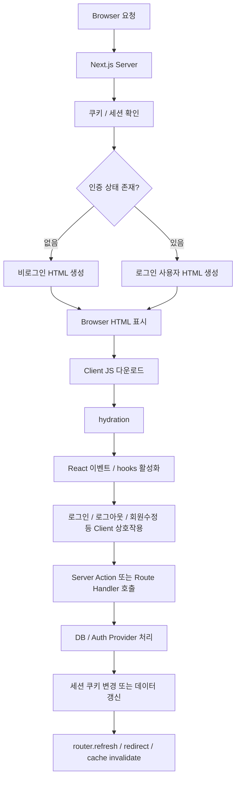
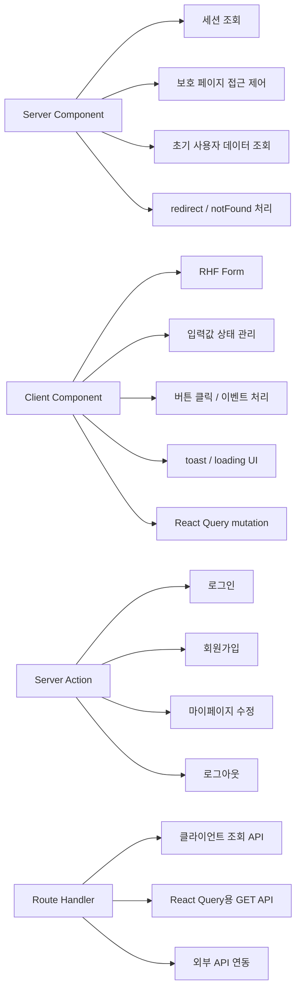
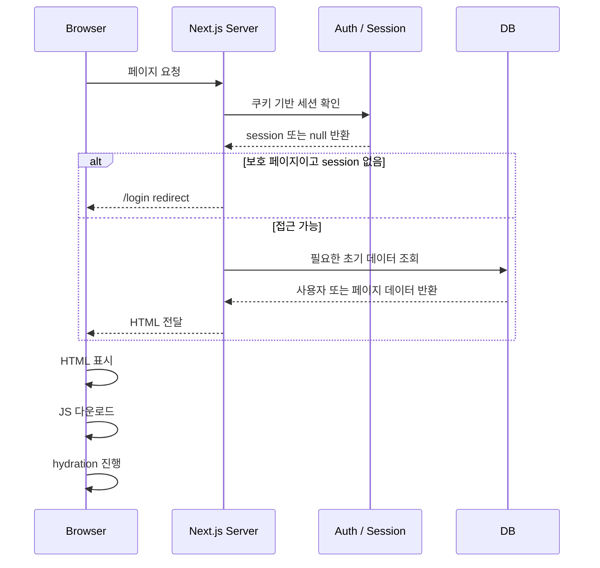
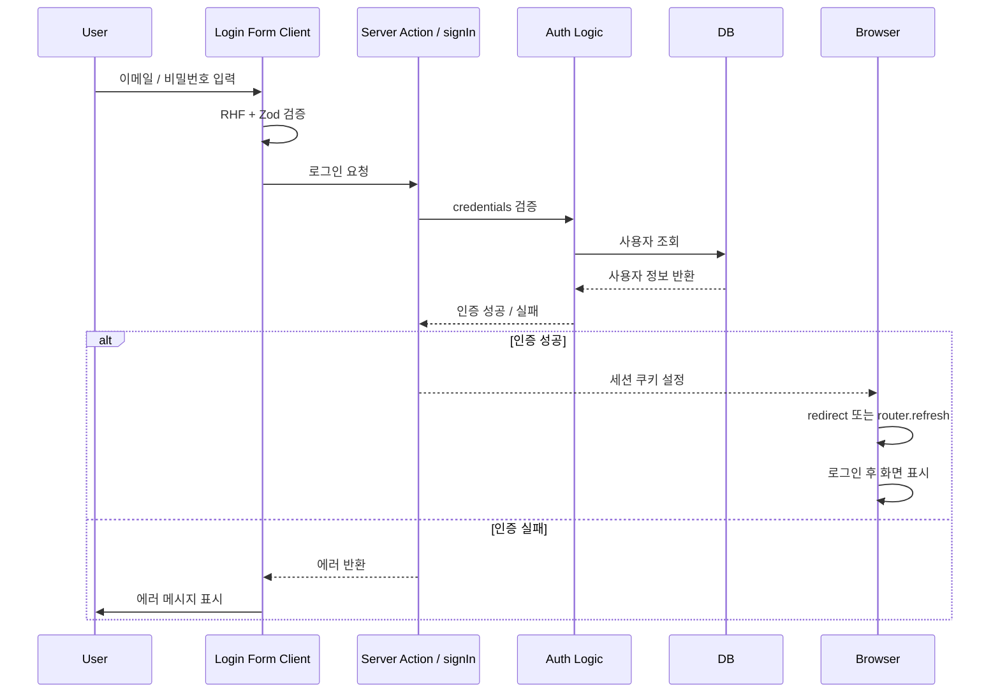
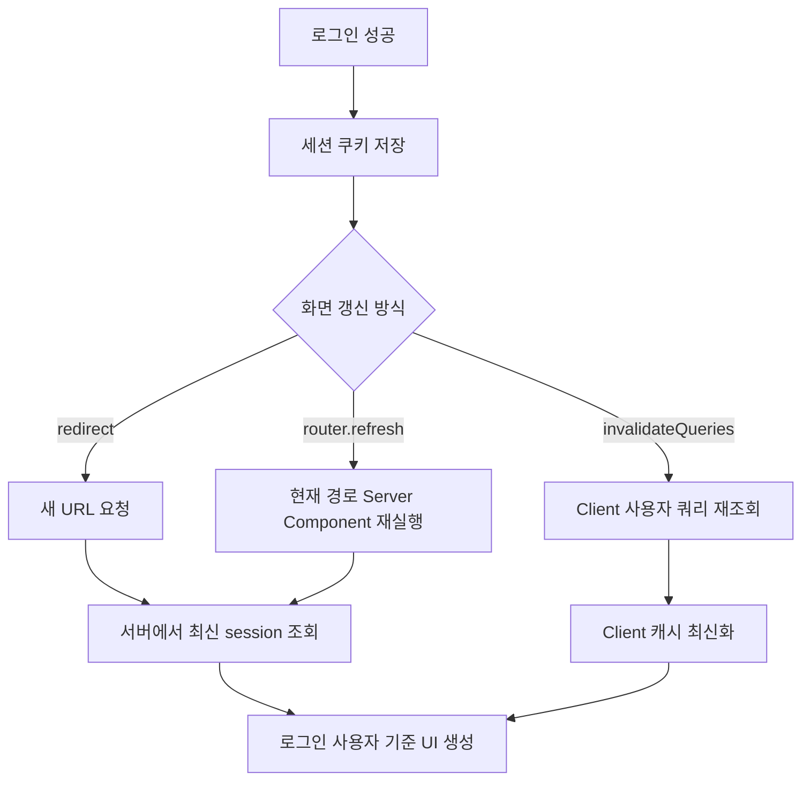
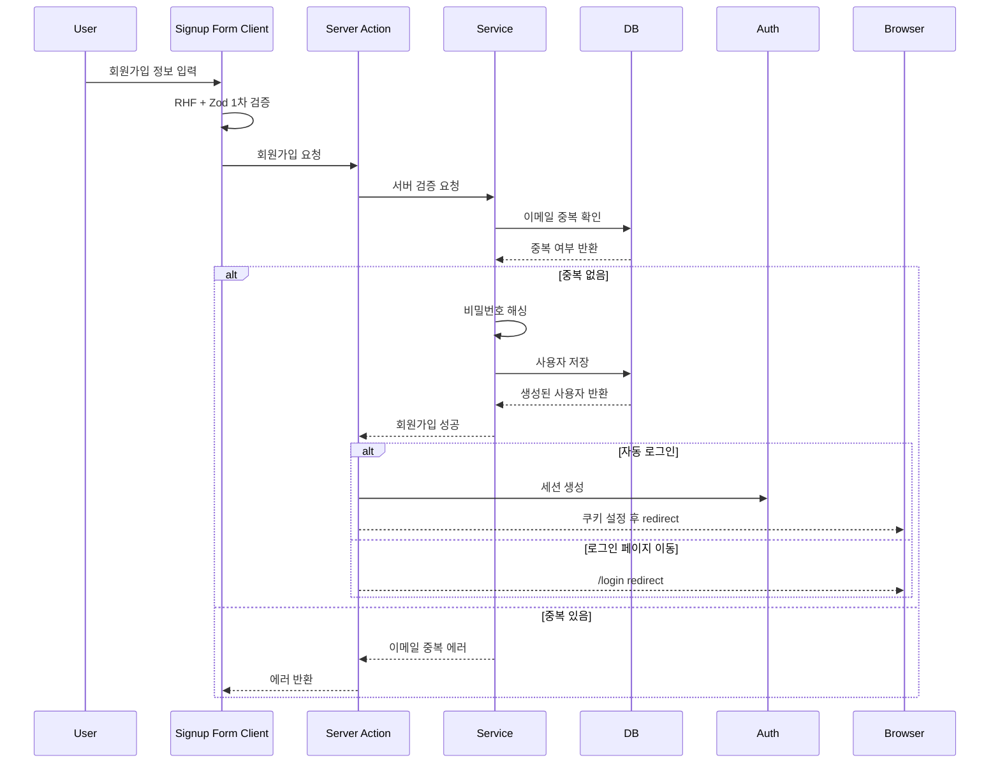
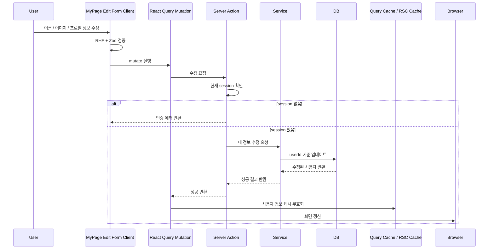
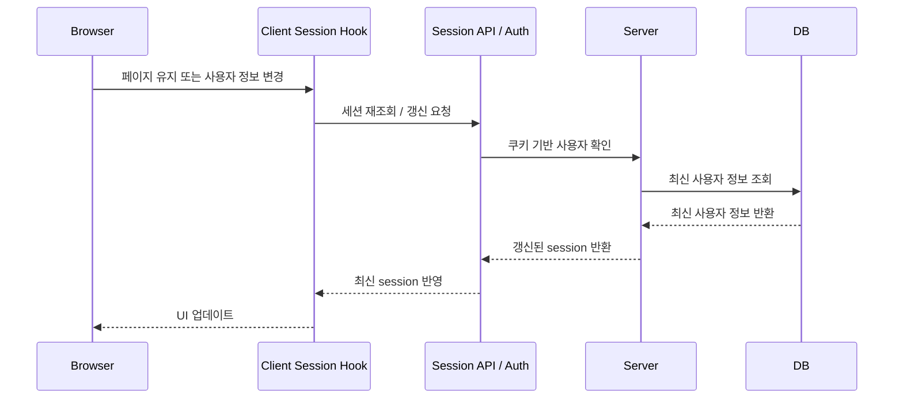
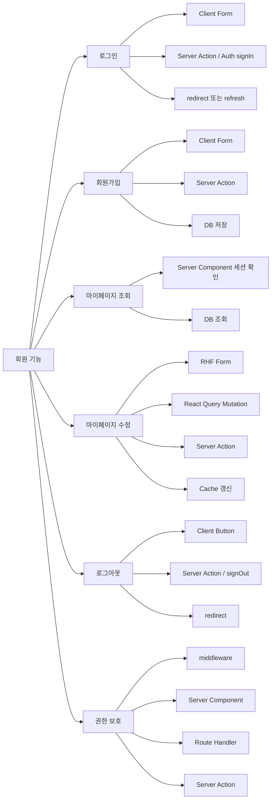
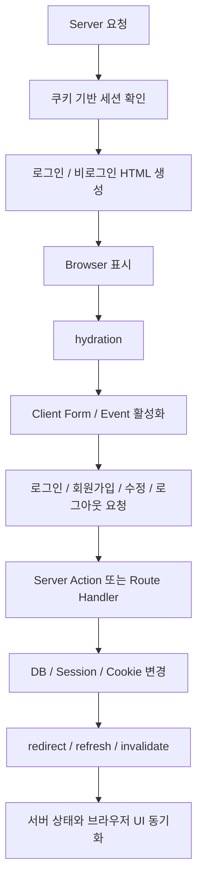

# Next.js 회원 기능 실행 흐름도

> 기준: Next.js App Router + Auth.js 또는 자체 인증 + React Query + RHF/Zod + nuqs/qs 사용 프로젝트
>
> 목적: 로그인, 회원가입, 마이페이지, 로그아웃, 세션 갱신이 Next.js의 Server Component, Client Component, hydration, Server Action, Route Handler 흐름 안에서 어떻게 동작하는지 단계별로 이해하기 위한 문서

---

## 목차

1. 전체 회원 기능 흐름 요약
2. 회원 기능에서 Server와 Client의 역할
3. 최초 페이지 진입 흐름
4. 로그인 전 화면 흐름
5. 로그인 처리 흐름
6. 로그인 후 화면 전환 흐름
7. 회원가입 처리 흐름
8. 마이페이지 조회 흐름
9. 마이페이지 수정 흐름
10. 로그아웃 흐름
11. 세션 갱신 흐름
12. 보호 페이지 접근 흐름
13. 회원 기능별 권장 처리 위치
14. 최종 요약

---

## 1. 전체 회원 기능 흐름 요약

회원 기능은 단순 CRUD와 다르게 “현재 사용자가 누구인지”를 서버와 브라우저 양쪽에서 계속 확인해야 한다.



핵심은 다음과 같다.

- 서버는 요청 시점의 쿠키를 기준으로 로그인 상태를 판단한다.
- 브라우저는 먼저 서버가 만든 HTML을 본다.
- hydration 이후에 Client Component의 이벤트와 React hooks가 동작한다.
- 로그인/로그아웃처럼 쿠키가 바뀌는 동작은 서버 처리가 끝난 뒤 화면을 다시 갱신해야 한다.
- 마이페이지처럼 사용자별 데이터가 필요한 페이지는 서버에서 세션을 먼저 확인하는 구조가 안전하다.

---

## 2. 회원 기능에서 Server와 Client의 역할



회원 기능에서 일반적으로 권장되는 기준은 다음과 같다.

| 구분                    | 권장 위치                            | 이유                                           |
| ----------------------- | ------------------------------------ | ---------------------------------------------- |
| 현재 로그인 사용자 확인 | Server Component / Server Function   | 쿠키 기반으로 안전하게 확인 가능               |
| 로그인 폼 입력          | Client Component                     | RHF, Zod, 이벤트 처리 필요                     |
| 로그인 처리             | Server Action 또는 Auth.js signIn    | 쿠키/세션 변경 필요                            |
| 회원가입 처리           | Server Action                        | FormData 처리, DB 저장, 검증에 적합            |
| 마이페이지 조회         | Server Component 또는 React Query    | 초기 보안 확인은 Server에서 처리하는 것이 안전 |
| 마이페이지 수정         | Server Action + React Query mutation | 변경 작업이므로 mutation 흐름에 적합           |
| 로그아웃                | Server Action 또는 Auth.js signOut   | 세션 쿠키 제거 필요                            |

---

## 3. 최초 페이지 진입 흐름

사용자가 `/login`, `/signup`, `/mypage` 같은 회원 관련 페이지에 접근하면 먼저 서버에서 렌더링이 시작된다.



이 단계에서 중요한 점은 Client Component도 서버에서 한 번 렌더링될 수 있다는 것이다. 다만 `useEffect`, 클릭 이벤트, 브라우저 전용 API는 hydration 이후에 동작한다.

---

## 4. 로그인 전 화면 흐름

로그인 전 사용자가 `/login` 페이지에 접근하면 서버는 비로그인 상태를 기준으로 HTML을 만든다.

```mermaid
flowchart TD
  A[/login 요청] --> B[Server Component 실행]
  B --> C[현재 session 확인]
  C --> D{이미 로그인 상태?}
  D -- 예 --> E[/mypage 또는 /dashboard redirect]
  D -- 아니오 --> F[로그인 페이지 HTML 생성]
  F --> G[Browser에 HTML 표시]
  G --> H[hydration]
  H --> I[RHF 로그인 폼 활성화]
```

로그인 페이지에서는 서버가 먼저 “이미 로그인한 사용자인지”를 확인하는 것이 좋다.

이미 로그인한 사용자가 `/login`에 접근했을 때 다시 로그인 폼을 보여주는 것보다, 마이페이지나 메인 페이지로 보내는 흐름이 일반적이다.

---

## 5. 로그인 처리 흐름

로그인은 사용자가 폼을 입력하고 제출한 뒤 서버에서 인증을 수행하는 흐름이다.



로그인 처리에서 핵심은 “브라우저 상태만 바꾸는 것이 아니라 서버 세션 또는 쿠키가 바뀐다”는 점이다.

따라서 로그인 성공 후에는 다음 중 하나가 필요하다.

| 방식                   | 설명                                                          |
| ---------------------- | ------------------------------------------------------------- |
| redirect               | 로그인 성공 후 서버에서 바로 목적지로 이동                    |
| router.refresh         | 현재 페이지의 Server Component를 다시 실행해서 최신 세션 반영 |
| React Query invalidate | 클라이언트에 캐싱된 사용자 정보가 있다면 무효화               |
| update session         | Auth.js 환경에서 클라이언트 세션 값을 갱신할 때 사용 가능     |

---

## 6. 로그인 후 화면 전환 흐름

로그인 성공 직후에는 서버 쿠키는 바뀌었지만, 현재 브라우저 화면의 일부 Client 상태는 이전 상태일 수 있다.



로그인 후 헤더, 사이드바, 마이페이지 링크, 사용자 프로필 영역이 바뀌어야 한다면 서버와 클라이언트 중 어디에서 사용자 정보를 들고 있는지에 따라 갱신 방식이 달라진다.

| 사용자 정보 위치                     | 로그인 후 필요한 처리               |
| ------------------------------------ | ----------------------------------- |
| Server Component에서 `auth()`로 조회 | redirect 또는 router.refresh        |
| React Query로 `/api/me` 조회         | query invalidate                    |
| Auth.js `useSession()` 사용          | session update 또는 provider 재검증 |
| Zustand 같은 Client Store 사용       | store 초기화 또는 setUser           |

실무에서는 헤더/사이드바처럼 전역 UI에 세션이 반영되는 경우 `router.refresh()` 또는 로그인 성공 후 redirect를 많이 사용한다.

---

## 7. 회원가입 처리 흐름

회원가입은 기본적으로 “입력 → 검증 → 중복 확인 → 비밀번호 해싱 → DB 저장 → 로그인 페이지 이동 또는 자동 로그인” 흐름이다.



회원가입에서 중요한 점은 Client의 Zod 검증만 믿으면 안 된다는 것이다.

Client 검증은 UX 개선용이고, 실제 보안 검증은 서버에서 다시 수행해야 한다.

---

## 8. 마이페이지 조회 흐름

마이페이지는 로그인한 사용자만 접근해야 하므로 서버에서 먼저 세션을 확인하는 구조가 안정적이다.

```mermaid
flowchart TD
  A[/mypage 요청] --> B[Server Component 실행]
  B --> C[auth 또는 getSession 실행]
  C --> D{session 존재?}
  D -- 없음 --> E[/login redirect]
  D -- 있음 --> F[session.user.id 확인]
  F --> G[DB에서 내 정보 조회]
  G --> H[마이페이지 HTML 생성]
  H --> I[Browser 표시]
  I --> J[hydration]
  J --> K[수정 버튼 / 폼 이벤트 활성화]
```

마이페이지 조회는 두 가지 방식이 가능하다.

| 방식                       | 흐름                            | 특징                                               |
| -------------------------- | ------------------------------- | -------------------------------------------------- |
| Server Component 직접 조회 | Server에서 세션 확인 후 DB 조회 | 초기 화면이 안정적이고 보안 처리 명확              |
| React Query 조회           | Client에서 `/api/me` 호출       | 화면 내 동적 갱신이 편하지만 초기 로딩 처리가 필요 |

실무 기준으로는 마이페이지 최초 진입은 Server Component에서 세션을 확인하고, 수정 이후 부분 갱신이 필요하면 React Query를 함께 사용하는 방식이 무난하다.

---

## 9. 마이페이지 수정 흐름

마이페이지 수정은 현재 로그인한 사용자만 자신의 정보를 변경할 수 있어야 한다.



마이페이지 수정에서 절대 피해야 할 흐름은 “Client에서 전달한 userId만 믿고 수정하는 것”이다.

수정 대상은 반드시 서버에서 확인한 `session.user.id`를 기준으로 결정해야 한다.

---

## 10. 로그아웃 흐름

로그아웃은 세션 쿠키를 제거하고, 로그인 사용자 기준으로 렌더링되던 UI를 비로그인 상태로 되돌리는 흐름이다.

```mermaid
flowchart TD
  A[로그아웃 버튼 클릭] --> B[Client 이벤트 실행]
  B --> C[Server Action / signOut 호출]
  C --> D[서버에서 세션 쿠키 제거]
  D --> E{이후 처리}
  E -- redirect --> F[/login 또는 / 이동]
  E -- router.refresh --> G[현재 페이지 Server Component 재실행]
  E -- invalidate --> H[사용자 쿼리 캐시 제거]
  F --> I[비로그인 화면 표시]
  G --> I
  H --> I
```

로그아웃 후 보호 페이지에 그대로 남아 있으면 안 된다.

따라서 `/mypage`, `/dashboard`, `/admin` 같은 페이지에서는 로그아웃 성공 후 공개 페이지나 로그인 페이지로 이동시키는 편이 안전하다.

---

## 11. 세션 갱신 흐름

세션 갱신은 로그인 상태가 유지되는 동안 사용자 정보나 만료 시간을 최신화하는 흐름이다.



세션에 사용자 이름, 이미지, 권한 같은 값을 넣어두는 경우 마이페이지 수정 후 세션 갱신 문제가 자주 발생한다.

예를 들어 이름을 수정했는데 헤더의 사용자 이름이 그대로라면, DB는 바뀌었지만 클라이언트 세션 또는 서버 렌더링 결과가 아직 갱신되지 않은 상태일 수 있다.

이때 사용하는 방식은 다음과 같다.

| 상황                             | 처리                        |
| -------------------------------- | --------------------------- |
| Server Component에서 사용자 표시 | router.refresh              |
| React Query로 사용자 표시        | invalidateQueries           |
| Auth.js useSession 기반 표시     | update 또는 session refetch |
| Client Store 기반 표시           | store 값 직접 갱신          |

---

## 12. 보호 페이지 접근 흐름

보호 페이지는 로그인하지 않은 사용자가 접근하면 서버 단계에서 막는 것이 좋다.

```mermaid
flowchart TD
  A[보호 페이지 요청] --> B[Server Component 또는 middleware]
  B --> C[세션 확인]
  C --> D{로그인 상태?}
  D -- 아니오 --> E[/login redirect]
  D -- 예 --> F{권한 확인 필요?}
  F -- 아니오 --> G[페이지 렌더링]
  F -- 예 --> H{권한 있음?}
  H -- 예 --> G
  H -- 아니오 --> I[403 페이지 또는 메인 redirect]
```

보호 처리는 위치에 따라 성격이 다르다.

| 처리 위치        | 적합한 경우          | 특징                                                  |
| ---------------- | -------------------- | ----------------------------------------------------- |
| middleware       | 넓은 경로 차단       | 빠르게 redirect 가능하지만 DB 조회 로직은 신중해야 함 |
| Server Component | 페이지별 세밀한 보호 | 세션 확인 후 redirect 처리 명확                       |
| Route Handler    | API 보호             | API 요청마다 인증/권한 확인 가능                      |
| Server Action    | 변경 작업 보호       | mutation 실행 시점에 최종 검증 가능                   |

중요한 기준은 화면 접근을 막는 것과 실제 데이터 변경을 막는 것을 분리해서 생각하는 것이다.

화면에서 버튼을 숨겨도 Server Action이나 API에서 다시 권한 검사를 해야 한다.

---

## 13. 회원 기능별 권장 처리 위치



회원 기능을 실무 구조로 나누면 다음 흐름이 가장 무난하다.

| 기능            | Form                | 검증            | 서버 처리                        | 화면 갱신                          |
| --------------- | ------------------- | --------------- | -------------------------------- | ---------------------------------- |
| 로그인          | RHF                 | Zod + 서버 검증 | Server Action / signIn           | redirect 또는 router.refresh       |
| 회원가입        | RHF                 | Zod + 서버 검증 | Server Action                    | redirect                           |
| 마이페이지 조회 | 없음 또는 Client UI | 서버 세션 확인  | Server Component / Route Handler | 초기 HTML 또는 Query 갱신          |
| 마이페이지 수정 | RHF                 | Zod + 서버 검증 | Server Action                    | invalidateQueries + router.refresh |
| 로그아웃        | 버튼                | 서버 세션 확인  | Server Action / signOut          | redirect                           |

---

## 14. 최종 요약

회원 관련 로직은 hydration 자체보다 “서버에서 확인한 인증 상태”와 “브라우저에서 보이는 UI 상태”가 언제 맞춰지는지를 이해하는 것이 중요하다.



정리하면 다음과 같다.

| 핵심                  | 설명                                                                  |
| --------------------- | --------------------------------------------------------------------- |
| 최초 로그인 상태 판단 | 서버에서 쿠키를 읽고 판단한다.                                        |
| 로그인 폼 동작        | hydration 이후 Client Component에서 동작한다.                         |
| 로그인 성공           | 서버에서 세션 쿠키가 설정된다.                                        |
| 화면 반영             | redirect, router.refresh, query invalidate가 필요하다.                |
| 마이페이지 보호       | Server Component 또는 middleware에서 먼저 막는 것이 좋다.             |
| 데이터 변경 보호      | Server Action 또는 Route Handler에서 반드시 다시 검증해야 한다.       |
| 세션 갱신             | 사용자 정보 표시 위치에 따라 refresh, invalidate, update 중 선택한다. |

회원 기능에서 가장 안전한 기준은 다음이다.

> 화면은 Client에서 편하게 만들고, 인증 판단과 데이터 변경 권한은 Server에서 최종 결정한다.
