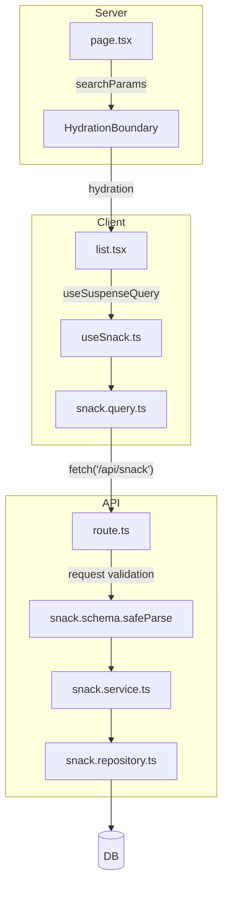

# 제목

## Library and Installation

| 라이브러리      | 용도  | 설치                  |
| --------------- | ----- | --------------------- |
| react-hook-form | TODO: | npm i react-hook-form |
| zod             | TODO: | TODO:                 |

```bash
npx create-next-app@latest 프로젝트이름
  ✔ Would you like to use the recommended Next.js defaults? › No, customize settings
  ✔ Would you like to use TypeScript? … No / Yes  # 타입스크립트 사용 여부
  ✔ Which linter would you like to use? › ESLint  # ESLint 사용 여부
  ✔ Would you like to use React Compiler? … No / Yes  # React Compiler 사용 여부
  ✔ Would you like to use Tailwind CSS? … No / Yes  # Tailwind CSS 사용 여부
  ✔ Would you like your code inside a `src/` directory? … No / Yes  # src/ 디렉토리 사용 여부
  ✔ Would you like to use App Router? (recommended) … No / Yes  # App Router 사용 여부
  ✔ Would you like to customize the import alias (`@/*` by default)? … No / Yes  # `@/*` 외 경로 별칭 사용 여부
```

---

## 기술 스택(Spec)

- UI
  - shadcn/ui
    - radix-ui
    - base-ui

- css
  - tailwind CSS

- component
  - form
    - form
    - Next/form → form action 최적화??
      - useFormStatus
      - useActionState
      - useTransition
    - RHF(react-hook-form) + zod
  - select
    - Select
    - Native Select
    - dynamic

- validation
  - zod

- state
  - `Server` @tanstack/react-query
    - prefetchQuery
    - useQuery
    - useSuspenseQuery
    - useMutation
  - `Client` Zustand

- util
  - search
    - qs
    - nuqs
  - date
    - `date-format` date-fns
    - `date-picker` react-day-picker

- alert
  - alert
  - toast(@deprecated) useToast/Toast/Toaster
  - sonner
  - AlertDialog

- common

- auth
  - bcryptjs
  - middleware.ts
  - proxy.ts

- DB
  - `Mock` json-server
  - `ORM` Prisma
  - `BO` nest.js, Java
  - Supabase

- etc
  - 공통 컴포넌트
  - API Response

- TDD
  - vitest
    - vi
  - jsdom
  - @vitest/ui
  - @testing-library
    - react
    - dom
    - user-event
    - jest-dom
  - msw
  - @vitest/coverage-v8
  - cypress
  - playwright

- Swagger

- CI/CD
  - docker
  - vercel
  - Git Actions
    - .github/workflows

- AI
  - gemini-cli
    - .gemini
      - GEMINI.md
      - settings.json
      - 2026.6.18 @deprecated 예정
  - AGENTS.md
  - Claude
    - CLAUDE.md
  - Codex

---

## 한번에 보기: 폴더 트리(주석 포함)

```text
📦frontend
 ┣ 📂.gemini
 ┃ ┣ 📜GEMINI.md
 ┃ ┣ 📜folder.tree
 ┃ ┣ 📜image.png
 ┃ ┗ 📜settings.json
 ┣ 📂.github
 ┃ ┗ 📂workflows
 ┃ ┃ ┣ 📜nextjs-app-ci.yml
 ┃ ┃ ┗ 📜playwright.yml
 ┣ 📂app
 ┃ ┣ 📂(default-layout)
 ┃ ┃ ┣ 📂(main)
 ┃ ┃ ┃ ┣ 📂notice
 ┃ ┃ ┃ ┗ 📂snack
 ┃ ┃ ┃ ┃ ┣ 📂[id]
 ┃ ┃ ┃ ┃ ┃ ┣ 📂edit
 ┃ ┃ ┃ ┃ ┃ ┃ ┗ 📜page.tsx
 ┃ ┃ ┃ ┃ ┃ ┗ 📜page.tsx
 ┃ ┃ ┃ ┃ ┣ 📂_components
 ┃ ┃ ┃ ┃ ┃ ┣ 📜clientPage.tsx
 ┃ ┃ ┃ ┃ ┃ ┣ 📜form.tsx
 ┃ ┃ ┃ ┃ ┃ ┣ 📜list.tsx
 ┃ ┃ ┃ ┃ ┃ ┣ 📜loader.tsx
 ┃ ┃ ┃ ┃ ┃ ┣ 📜pagination.tsx
 ┃ ┃ ┃ ┃ ┃ ┣ 📜search-loader.tsx
 ┃ ┃ ┃ ┃ ┃ ┣ 📜search.tsx
 ┃ ┃ ┃ ┃ ┃ ┗ 📜sort.tsx
 ┃ ┃ ┃ ┃ ┣ 📂new
 ┃ ┃ ┃ ┃ ┃ ┗ 📜page.tsx
 ┃ ┃ ┃ ┃ ┗ 📜page.tsx
 ┃ ┃ ┣ 📂(public)
 ┃ ┃ ┃ ┣ 📂_components
 ┃ ┃ ┃ ┃ ┣ 📜login-form.tsx
 ┃ ┃ ┃ ┃ ┣ 📜nav-user.tsx
 ┃ ┃ ┃ ┃ ┗ 📜signin-form.tsx
 ┃ ┃ ┃ ┣ 📂login
 ┃ ┃ ┃ ┃ ┗ 📜page.tsx
 ┃ ┃ ┃ ┣ 📂mypage
 ┃ ┃ ┃ ┃ ┗ 📜page.tsx
 ┃ ┃ ┃ ┣ 📂signin
 ┃ ┃ ┃ ┃ ┗ 📜page.tsx
 ┃ ┃ ┃ ┗ 📂signup
 ┃ ┃ ┃ ┃ ┗ 📜page.tsx
 ┃ ┃ ┣ 📜error.tsx
 ┃ ┃ ┣ 📜layout.tsx
 ┃ ┃ ┣ 📜loading.tsx
 ┃ ┃ ┣ 📜not-found.tsx
 ┃ ┃ ┗ 📜provider.tsx
 ┃ ┣ 📂(empty-layout)
 ┃ ┃ ┣ 📜layout.tsx
 ┃ ┃ ┗ 📜page.tsx
 ┃ ┗ 📂api
 ┃ ┃ ┣ 📂auth
 ┃ ┃ ┃ ┗ 📂[...nextauth]
 ┃ ┃ ┃ ┃ ┗ 📜route.ts
 ┃ ┃ ┣ 📂notice
 ┃ ┃ ┃ ┗ 📜route.ts
 ┃ ┃ ┗ 📂snack
 ┃ ┃ ┃ ┣ 📂[id]
 ┃ ┃ ┃ ┃ ┗ 📜route.ts
 ┃ ┃ ┃ ┗ 📜route.ts
 ┣ 📂features
 ┃ ┣ 📂auth
 ┃ ┣ 📂common
 ┃ ┗ 📂snack
 ┃ ┃ ┣ 📂actions
 ┃ ┃ ┃ ┗ 📜snack.action.ts
 ┃ ┃ ┣ 📂components
 ┃ ┃ ┃ ┣ 📜README.md
 ┃ ┃ ┃ ┣ 📜columns.tsx
 ┃ ┃ ┃ ┗ 📜snack-table.tsx
 ┃ ┃ ┣ 📂hooks
 ┃ ┃ ┃ ┗ 📜useSnack.ts
 ┃ ┃ ┣ 📂prefetch
 ┃ ┃ ┃ ┗ 📜snack.prefetch.ts
 ┃ ┃ ┣ 📂queries
 ┃ ┃ ┃ ┗ 📜snack.query.ts
 ┃ ┃ ┣ 📂repositories
 ┃ ┃ ┃ ┣ 📜snack.api.repository.ts
 ┃ ┃ ┃ ┣ 📜snack.json.repository.ts
 ┃ ┃ ┃ ┗ 📜snack.prisma.repository.ts
 ┃ ┃ ┣ 📂schema
 ┃ ┃ ┃ ┗ 📜snack.schema.ts
 ┃ ┃ ┣ 📂services
 ┃ ┃ ┃ ┗ 📜snack.service.ts
 ┃ ┃ ┗ 📂types
 ┃ ┃ ┃ ┗ 📜snack.type.ts
 ┣ 📂mock
 ┃ ┣ 📂docs
 ┃ ┃ ┃ ┣ 📜member-project-detail-snippets.md
 ┃ ┃ ┃ ┗ 📜README.md
 ┃ ┃ ┗ 📂images
 ┃ ┣ 📜notice.json
 ┃ ┗ 📜snack.json
 ┣ 📂public
 ┣ 📂shared
 ┃ ┣ 📂components
 ┃ ┃ ┣ 📂provider
 ┃ ┃ ┃ ┗ 📜session.tsx
 ┃ ┃ ┣ 📂ui
 ┃ ┃ ┃ ┣ 📂custom
 ┃ ┣ 📂hooks
 ┃ ┃ ┣ 📜use-mobile.ts
 ┃ ┃ ┗ 📜use-toast.ts
 ┃ ┣ 📂lib
 ┃ ┃ ┣ 📂axios
 ┃ ┃ ┃ ┣ 📜core.ts
 ┃ ┃ ┃ ┣ 📜external.ts
 ┃ ┃ ┃ ┗ 📜interceptor.ts
 ┃ ┃ ┣ 📜auth.ts
 ┃ ┃ ┣ 📜fetch.ts
 ┃ ┃ ┣ 📜prisma.ts
 ┃ ┃ ┣ 📜react-query.ts
 ┃ ┃ ┣ 📜toast.ts
 ┃ ┃ ┗ 📜utils.ts
 ┃ ┣ 📂styles
 ┃ ┃ ┗ 📜globals.css
 ┃ ┗ 📂types
 ┃ ┃ ┣ 📜auth.d.ts
 ┃ ┃ ┣ 📜base.type.ts
 ┃ ┃ ┗ 📜env.d.ts
 ┣ 📂tests
 ┃ ┗ 📜example.spec.ts
 ┣ 📜.env.local
 ┣ 📜.gitignore
 ┣ 📜.prettierrc
 ┣ 📜cypress.config.ts
 ┣ 📜eslint.config.mjs
 ┣ 📜next-env.d.ts
 ┣ 📜next.config.ts
 ┣ 📜package.json
 ┣ 📜playwright.config.ts
 ┣ 📜postcss.config.mjs
 ┣ 📜proxy.ts
 ┣ 📜tsconfig.json
 ┣ 📜vitest.config.ts
 ┗ 📜vitest.setup.ts
```

```text
📦frontend/features/snack
┣ 📂actions/
┃ ┗ 📜snack.action.ts          # Server Actions (CUD 작업 전담, Service 호출)
┃
┣ 📂hooks/
┃ ┗ 📜useSnack.ts              # React Query 커스텀 훅 (useQuery, useMutation)
┃
┣ 📂prefetch/
┃ ┗ 📜snack.prefetch.ts        # Server-side Hydration을 위한 Prefetch 로직
┃
┣ 📂queries/
┃ ┗ 📜snack.query.ts           # Query Key Factory + Query Options 정의
┃
┣ 📂repositories/              # 데이터 소스별 구현체 분리
┃ ┣ 📜snack.api.repository.ts  # 외부 API / JSON Server 연동
┃ ┣ 📜snack.prisma.repository..ts # Prisma / DB 직접 연동 (⚠️파일명 오타 주의)
┃ ┗ 📂dummy/
┃   ┗ 📜snack.repository.ts     # 개발/테스트용 Mock Repository
┃
┣ 📂services/
┃ ┗ 📜snack.service.ts         # 비즈니스 로직 및 Repository 오케스트레이션
┃
┣ 📂schema/
┃ ┗ 📜snack.schema.ts          # Zod 기반 Runtime Validation 및 Infer Type
┃
┗ 📂types/
  ┗ 📜snack.type.ts            # 도메인 모델 및 API Contract 타입 정의
```

---

## 스니펫(Snippet)

---

| 필드            | 설명                                                                         |
| --------------- | ---------------------------------------------------------------------------- |
| Form            | `RHF`의 `FormProvider`를 래핑한 컴포넌트로, 폼의 상태를 하위 컴포넌트에 공유 |
| FormField       |                                                                              |
| FormItem        |                                                                              |
| FormLabel       |                                                                              |
| FormControl     |                                                                              |
| FormDescription |                                                                              |
| FormMessage     |                                                                              |

---

## Service

조회/상세/생성/수정/삭제

> 화면 구조  
> **상단: 필터 / 검색**  
> **중단: 정렬**  
> **하단: 목록**  
> **최하단: 페이징**

1. 조회

- 검색어 입력 + 검색 버튼 → next/form 또는 일반 form
- 필터 / 정렬 / 페이징 → nuqs
- 목록 조회 / 캐시 / 재조회 → TanStack Query, React Query

2. 변경

- 등록 / 수정 form → React Hook Form + zod

```txt
page.tsx
  ↓ `Server` searchParams 처리
snack.prefetch.ts
  ↓ `Server` prefetchQuery
HydrationBoundary
  ↓
list.tsx
  ↓ `Client` useSuspenseQuery
useSnack.ts
  ↓
snack.query.ts
  ↓
fetch('/api/snack')
  ↓ `Server` Route Handler
route.ts
  ↓ `Server` request validation
snack.schema.safeParse
  ↓
snack.service.ts
  ↓
snack.repository.ts
  ↓
DB
```




---

## 보완 필요

- [ ] **반응형 최적화**: 화면 크기에 따라 사이드바가 접히거나 작업 리스트의 레이아웃이 유연하게 변하도록 개선.
- [ ] TODO:

---

## 향후 계획

┣ 📂app
┃ ┣ 📂(default-layout)
┃ ┃ ┣ 📂(main)
┃ ┃ ┃ ┣ 📂snack
┃ ┃ ┃ ┗ 📂board
┃ ┃ ┣ 📂(public)
┃ ┃ ┃ ┣ 📂login
┃ ┃ ┃ ┣ 📂mypage
┃ ┃ ┃ ┗ 📂signup

> snack, board(기본 CRUD), auth

```text
1. `Layout` 메인 구성
  - sidebar, header, main, footer
  - loading, error, not-found
2. `Service` CRUD 서비스 → 공통 컴포넌트를 통한 최대한의 모듈화(프로토타입) 구성
  - `조회` 검색/필터/정렬/목록/페이징
    - 검색어 입력 + 검색 버튼 → next/form 또는 일반 form
    - 필터 / 정렬 / 페이징 → nuqs
    - 목록 조회 / 캐시 / 재조회 → React Query
  - `상세`
  - `변경` 등록/수정 → RHF(form) + zod
  - `삭제`
3. `DB` 여러 repository 구현
  - json-server, Java, nest.js, prisma, supabase
4. `Etc`
  - TDD
  - CI/CD
  - Swagger
```

---

## 참고한 공식 문서 기준

- Next.js `Form`은 form submissions와 search params 업데이트를 client-side navigation으로 처리하는 컴포넌트다.
- Next.js `useSearchParams`는 Client Component에서 query string을 읽기 위한 hook이다.
- nuqs는 URL query string을 React state처럼 다루기 위한 type-safe search params state manager다.
- TanStack Query는 서버 상태 조회, 캐싱, background update, stale data 관리를 위한 라이브러리다.
- zod는 TypeScript-first validation library다.
- React Hook Form resolvers는 zod 같은 외부 validation library를 RHF와 연결한다.

---

## 출처

- Next.js Form Component: https://nextjs.org/docs/app/api-reference/components/form
- Next.js useSearchParams: https://nextjs.org/docs/app/api-reference/functions/use-search-params
- nuqs GitHub: https://github.com/47ng/nuqs
- TanStack Query Overview: https://tanstack.com/query/latest/docs/framework/react/overview
- TanStack Query queryOptions: https://tanstack.com/query/latest/docs/framework/react/guides/query-options
- Zod: https://zod.dev/
- React Hook Form useForm: https://react-hook-form.com/docs/useform
- React Hook Form Resolvers: https://github.com/react-hook-form/resolvers
